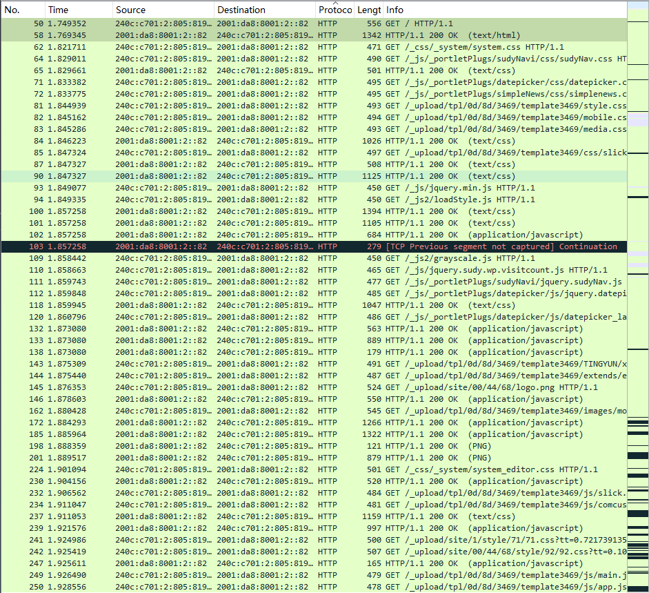
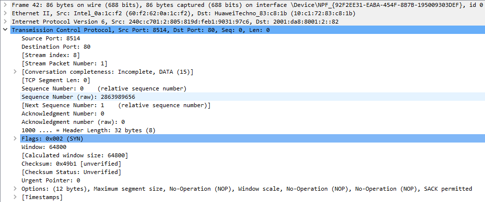
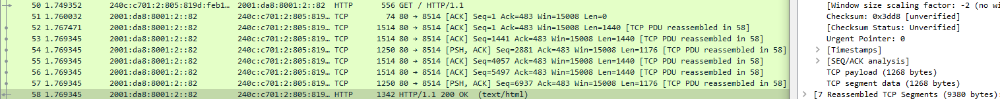
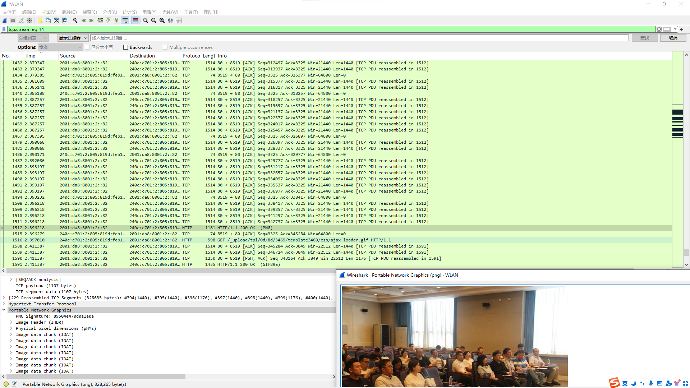
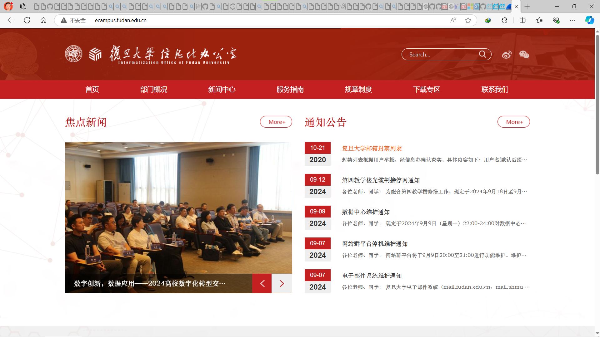
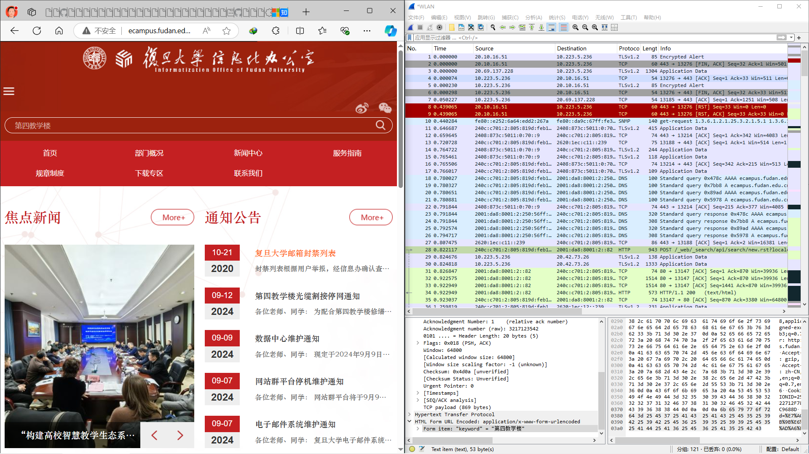
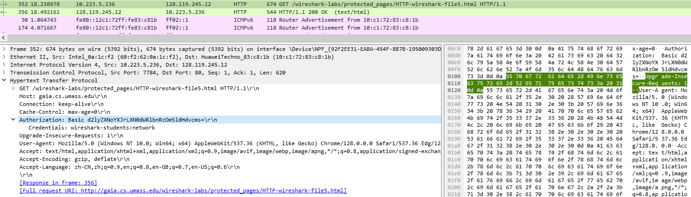

1. ## 请列出捕获到的5种不同类型的协议。
   DNS, TLSv1.2, TCP, HTTP, UDP
2. ### 用显示过滤器过滤出所有http消息，从发送第一条 HTTP GET 请求到收到对应的 HTTP OK 回复用了多长时间？  
   1.769345-1.749352 = 0.019993（秒）
   
3. ### 复旦信息办的 IP 地址是什么？你的计算机发送 HTTP GET 请求时的 IP 地址是什么？  
   复旦信息办是2001:da8:8001:2::82，也可以通过`ping ping ecampus.fudan.edu.cn`得到。  
   本机是240c:c701:2:805:819d:feb1:9031:97c6。
4. ### 找到任意一个 HTTP 包，发出 HTTP 请求的网络浏览器是什么？
   找到这一段:
   `User-Agent: Mozilla/5.0 (Windows NT 10.0; Win64; x64) AppleWebKit/537.36 (KHTML, like Gecko) Chrome/128.0.0.0 Safari/537.36 Edg/128.0.0.0\r\n`
   解释：

    Mozilla/5.0： 网景公司浏览器的标识，由于互联网初期浏览器市场主要被网景公司占领，很多服务器被设置成仅响应含有标志为Mozilla的浏览器的请求，因此，新款的浏览器为了打入市场，不得不加上这个字段。

    Windows NT 10.0 : Windows 10的标识符  

    Win64; x64： 64位的Windows系统运行在64位的处理器上

    AppleWebKit/537.36：苹果公司开发的呈现引擎

    KHTML：是Linux平台中Konqueror浏览器的呈现引擎KHTML

    Geckeo：呈现引擎

    like Gecko：表示其行为与Gecko浏览器引擎类似

   Microsoft Edge 浏览器基于Chrome开发，因而也会带上Chrome。

   最后一串是Edg，说明使用的是 Microsoft Edge 浏览器。

5. ### 找到任意一个 TCP 包，源端口号和目的端口号各自是什么？
   Transmission Control Protocol, Src Port: 8514, Dst Port: 80, Seq: 0, Len: 0
    Source Port: 8514
    Destination Port: 80
   
6. ### 找到一个由多个 TCP 报文段组合而成的 HTTP 响应分组，这个分组是由多少个 TCP 报文段组成的？
   7个。
   [7 Reassembled TCP Segments (9380 bytes): #52(1440), #53(1440), #54(1176), #55(1440), #56(1440), #57(1176), #58(1268)]
   
7. ### 找到一个带有明文图片的分组，通过“显示分组字节”在 wireshark中显示图片，并在浏览器中找到对应图片。
   图片分组如图：
   
   就是网页左侧的图片。
   
8. ### 重新开启分组捕获，在复旦信息办网站右上角的导航栏搜索任意内容，在捕获到的分组里寻找你输入的内容，观察 HTTP 如何通过 POST 方法发送数据。
   HTTP通过POST方法发送以下包
   HTML Form URL Encoded: application/x-www-form-urlencoded
    Form item: "keyword" = "第四教学楼"

   在图片右下角。
   
9. ### 在抓取的分组中找到输入的用户名和密码（传输使用了base64编码）。将地址中的http改为https，还能否通过捕获分组获得密码？
    可以看到密码明文，就在Authorization.Credentials里面。
    
    改为HTTPS直接抓取不到分组。