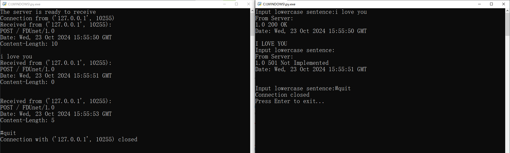
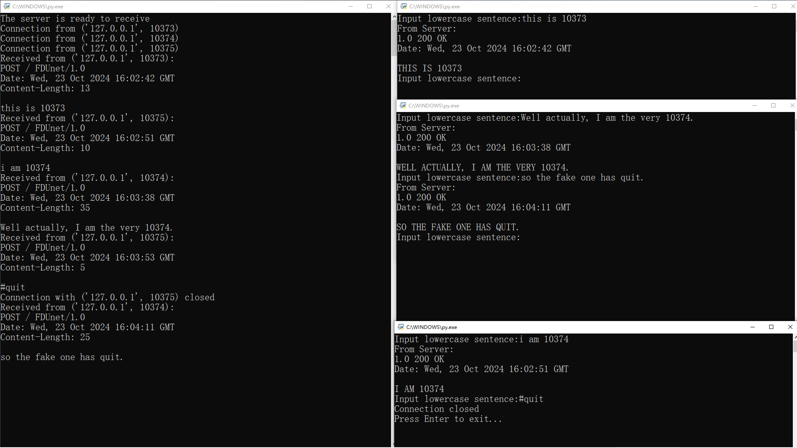
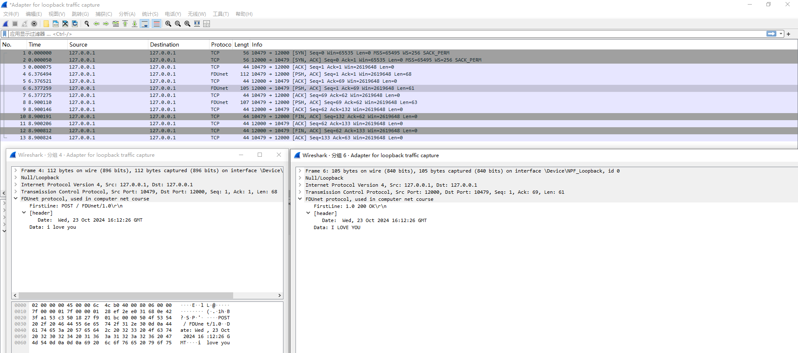

1. 对有内容报文，转换为大写，状态为200 OK；无内容报文则为501 Not Implemented。
2. 这是一个服务端与一个客户端连续发送的多条消息。

3. 一个服务器同时与多个客户端建立连接，并发送消息。
4. 任一客户端输入 #quit 后，双方关闭连接，但服务器继续服务其他客户端。

5. 用Wireshark抓取一对请求和应答如下：
（去掉了上面的Content-Length字段）

