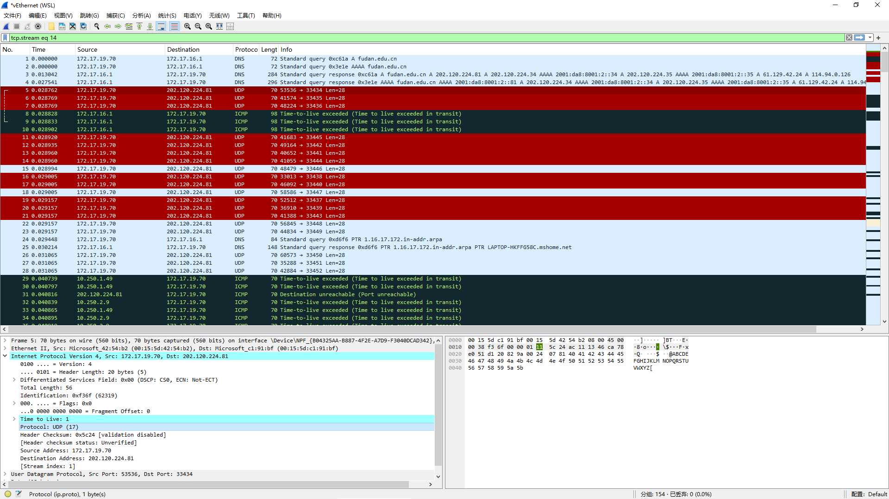

# Lab 5：网络层数据平面观察实验

part1
---


1. 第一个发送的UDP包
   1. 发送端IP地址是172.17.19.70
   2. 上层协议是17，代表UDP
   3. header length 20。有效载荷Payload = total - header = 56 - 20 = 36.
   4. 否。检查UDP包的Fragment Offset字段，全都是0
2. 观察连续的UDP包（穿插其他包）
   1. 不断变化的有 Identification, Time to Live 和 Header Checksum。
      保持不变的有 Version: 4, Header Length: 20, Differentiated Services Field: 0b000000；
      Total Length 不变
   2. 
   ```
   必须保持不变：
   
       版本：占4 bit ，通信双方使用的版本必须一致，对于IPv4字段的值是4;
       首部长度：占4 bit ，首部长度说明首部有多少32位字（4字节）由于IPv4首部可能包含数目不定的选项，这个字段也用来确定数据的偏移量；
       区分服务：占6bit，只有在使用区分服务时，这个字段才起作用，在一般的情况下都不使用这个字段；
   
   保持不变：
   
       显式拥塞通告：允许在不丢弃报文的同时通知对方网络拥塞的发生
       全长：占16位字段，定义了报文总长，包含首部和数据，单位为字节。这个字段的最小值是20(0字节数据），最大值是65535。
       标识符：占16位，这个字段主要被用来唯一地标识一个报文的所有分片，因为分片不一定按序到达，所以在重组时需要知道分片所属的报文
       分片偏移：这个13位字段指明了每个分片相对于原始报文开头的偏移量，以8字节作单位。
       源地址：报文的发送端；
       目的地址：报文的接收端；
       选项：附加的首部字段可能跟在目的地址之后；
   
   必须更改
   
       标识符：占16位，主要被用来唯一地标识一个报文的所有分片；
       存活时间：占8位，避免报文在互联网中永远存在。实现为跳数计数器，报文经过的每个路由器都将此字段减1，当此字段等于0时，报文不再向下一跳传送并被丢弃，最大值是255这是 traceroute 的核心原理；
       首部检验和：占16位，检验和字段只对首部查错，在每一跳，路由器都要重新计算出的首部检验和并与此字段进行比对，如果不一致，此报文将会被丢弃；
       数据：所谓的保持不变指的是这次 traceroute 不会改变的，但是下一次 traceroute 可能就会改了。
   ```