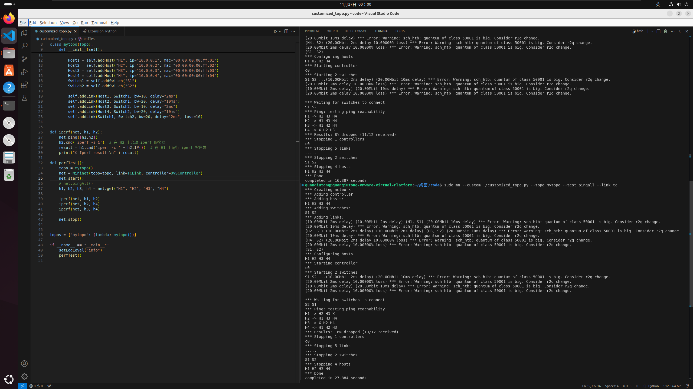

# Lab 5：网络层数据平面观察实验

## part1
---


### 1. 第一个发送的UDP包
   1. 发送端IP地址是172.17.19.70
   2. 上层协议是17，代表UDP
   3. header length 20。有效载荷Payload = total - header = 56 - 20 = 36.
   4. 否。检查UDP包的Fragment Offset字段，全都是0
### 2. 观察连续的UDP包（穿插其他包）
   1. 不断变化的有 Identification, Time to Live 和 Header Checksum。
      保持不变的有 
      Version, Header Length, Differentiated Services Field, Total Length, Flags, Fragment Offset, Protocol, Source Address, Destination Address, Source Port, Destination Port。

    ```log
    Internet Protocol Version 4, Src: 172.17.19.70, Dst: 202.120.224.81
    0100 .... = Version: 4
    .... 0101 = Header Length: 20 bytes (5)
    Differentiated Services Field: 0x00 (DSCP: CS0, ECN: Not-ECT)
        0000 00.. = Differentiated Services Codepoint: Default (0)
        .... ..00 = Explicit Congestion Notification: Not ECN-Capable Transport (0)
    Total Length: 56
    Identification: 0xf36f (62319)
    000. .... = Flags: 0x0
    ...0 0000 0000 0000 = Fragment Offset: 0
    Time to Live: 1
    Protocol: UDP (17)
    Header Checksum: 0x5c24 [validation disabled]
    [Header checksum status: Unverified]
    Source Address: 172.17.19.70
    Destination Address: 202.120.224.81
    [Stream index: 1]

    ```
    以及有效载荷的内容也不变，这是因为traceroute每次发送的UDP包的有效载荷内容是一样的。

   2. 为什么有些字段不断变化，为什么有些不变 ？
   ```txt
   必须保持不变：
   
       版本：占4 bit ，通信双方使用的版本必须一致，对于IPv4字段的值是4;
       首部长度：占4 bit ，首部长度说明首部有多少32位字（4字节）由于IPv4首部可能包含数目不定的选项，这个字段也用来确定数据的偏移量；
       区分服务：占6bit，只有在使用区分服务时，这个字段才起作用，在一般的情况下都不使用这个字段；
   
   保持不变：
   
       显式拥塞通告：允许在不丢弃报文的同时通知对方网络拥塞的发生
       全长：占16位字段，定义了报文总长，包含首部和数据，单位为字节。这个字段的最小值是20（0字节数据），最大值是65535。
       标识符：占16位，这个字段主要被用来唯一地标识一个报文的所有分片，因为分片不一定按序到达，所以在重组时需要知道分片所属的报文
       分片偏移：这个13位字段指明了每个分片相对于原始报文开头的偏移量，以8字节作单位。
       源地址：报文的发送端；
       目的地址：报文的接收端；
       选项：附加的首部字段可能跟在目的地址之后；
   
   必须更改
   
       标识符：占16位，主要被用来唯一地标识一个报文的所有分片；
       存活时间：占8位，避免报文在互联网中永远存在。实现为跳数计数器，报文经过的每个路由器都将此字段减1，当此字段等于0时，报文不再向下一跳传送并被丢弃，最大值是255
       这是 traceroute 的核心原理；
       首部检验和：占16位，检验和字段只对首部查错，在每一跳，路由器都要重新计算出的首部检验和并与此字段进行比对，如果不一致，此报文将会被丢弃；
       数据：所谓的保持不变指的是这次 traceroute 不会改变的，但是下一次 traceroute 可能就会改了。
   ```
   3. 列出连续IP数据报中的标识序列
      0xf36f, 0x4609, 0xa333
### 3. 观察收到的第一个TTL-exceeded replies
   1. 标识字段与TTL字段分别是多少？
      0x0006, 128
   2. 收到的所有TTL-exceeded replies中，这两个字段是否不变？为什么？
      ID 改变，TTL 不变。因为每次收到的TTL-exceeded replies都是不同的报文，所以ID会改变，而TTL-exceeded replies是由同一个路由器返回的，到本机的转发次数相同（都是0），所以TTL不变。

## part2
---

*我的 Ubuntu 版本是 24.04.1 LTS*

   iperf version 2.1.9 (14 March 2023) pthreads

### 任务1：定制化拓扑

#### 1. 利用iperf验证端到端带宽

该iperf版本下，直接用`net.iperf((h1, h2))`会卡住，所以用了如下函数：

```python
def iperf(net, h1, h2):
    net.ping([h1,h2])
    h2.cmd('iperf -s &')  # 在 H2 上启动 iperf 服务器
    result = h1.cmd('iperf -c ' + h2.IP())  # 在 H1 上运行 iperf 客户端
    print("$ Iperf result:\n" + result)
```


```log
$ Iperf result:
------------------------------------------------------------
Client connecting to 10.0.0.2, TCP port 5001
TCP window size: 85.3 KByte (default)
------------------------------------------------------------
[  1] local 10.0.0.1 port 45110 connected with 10.0.0.2 port 5001 (icwnd/mss/irtt=14/1448/27089)
[ ID] Interval       Transfer     Bandwidth
[  1] 0.0000-12.5478 sec  14.3 MBytes  9.53 Mbits/sec
```
```log
$ Iperf result:
------------------------------------------------------------
Client connecting to 10.0.0.4, TCP port 5001
TCP window size: 85.3 KByte (default)
------------------------------------------------------------
[  1] local 10.0.0.2 port 46936 connected with 10.0.0.4 port 5001 (icwnd/mss/irtt=14/1448/49318)
[ ID] Interval       Transfer     Bandwidth
[  1] 0.0000-14.6688 sec   912 KBytes   509 Kbits/sec
```
```log
$ Iperf result:
------------------------------------------------------------
Client connecting to 10.0.0.4, TCP port 5001
TCP window size: 85.3 KByte (default)
------------------------------------------------------------
[  1] local 10.0.0.3 port 57586 connected with 10.0.0.4 port 5001 (icwnd/mss/irtt=14/1448/26192)
[ ID] Interval       Transfer     Bandwidth
[  1] 0.0000-12.8798 sec  14.6 MBytes  9.53 Mbits/sec
```

也使用要求的iperf版本（2.0.5）上的`net.iperf()`测试了一下，结果如下：

```
*** Iperf: testing TCP bandwidth between H1 and H2 
*** Results: ['7.87 Mbits/sec', '9.13 Mbits/sec']
*** Iperf: testing TCP bandwidth between H2 and H4 
*** Results: ['629 Kbits/sec', '724 Kbits/sec']
*** Iperf: testing TCP bandwidth between H3 and H4 
*** Results: ['8.59 Mbits/sec', '9.93 Mbits/sec']
```

与期望的结果一致，即1->2和3->4的带宽接近理论值，2->4的带宽远低于理论值。


#### 2. ping all 测试：
   


测试几次，丢包率为8%, 16%, 12%等，和理论值较为接近。

并且所有测试中，1->2和3->4都能ping通。

### 任务2：在虚拟终端上执行任务

#### 1. Flow 1 和 Flow 2 带宽测试结果


```log
------------------------------------------------------------
Client connecting to 10.0.0.3, TCP port 5001
TCP window size: 85.3 KByte (default)
------------------------------------------------------------
[  1] local 10.0.0.1 port 54920 connected with 10.0.0.3 port 5001 (icwnd/mss/irtt=14/1448/31212)
[ ID] Interval       Transfer     Bandwidth
[  1] 0.0000-0.5000 sec   384 KBytes  6.29 Mbits/sec
[  1] 0.5000-1.0000 sec   200 KBytes  3.28 Mbits/sec
[  1] 1.0000-1.5000 sec  0.000 Bytes  0.000 bits/sec
[  1] 1.5000-2.0000 sec  80.6 KBytes  1.32 Mbits/sec
[  1] 2.0000-2.5000 sec  0.000 Bytes  0.000 bits/sec
[  1] 2.5000-3.0000 sec  82.0 KBytes  1.34 Mbits/sec
[  1] 3.0000-3.5000 sec  79.2 KBytes  1.30 Mbits/sec
[  1] 3.5000-4.0000 sec  63.6 KBytes  1.04 Mbits/sec
[  1] 4.0000-4.5000 sec  0.000 Bytes  0.000 bits/sec
[  1] 4.5000-5.0000 sec  70.7 KBytes  1.16 Mbits/sec
[  1] 5.0000-5.5000 sec   147 KBytes  2.41 Mbits/sec
[  1] 5.5000-6.0000 sec   148 KBytes  2.43 Mbits/sec
[  1] 6.0000-6.5000 sec  80.6 KBytes  1.32 Mbits/sec
[  1] 6.5000-7.0000 sec  63.6 KBytes  1.04 Mbits/sec
[  1] 7.0000-7.5000 sec  63.6 KBytes  1.04 Mbits/sec
[  1] 7.5000-8.0000 sec  84.8 KBytes  1.39 Mbits/sec
[  1] 8.0000-8.5000 sec   154 KBytes  2.53 Mbits/sec
[  1] 8.5000-9.0000 sec   163 KBytes  2.66 Mbits/sec
[  1] 9.0000-9.5000 sec  82.0 KBytes  1.34 Mbits/sec
[  1] 9.5000-10.0000 sec  0.000 Bytes  0.000 bits/sec
[  1] 10.0000-10.5000 sec  63.6 KBytes  1.04 Mbits/sec
[  1] 10.5000-11.0000 sec  0.000 Bytes  0.000 bits/sec
[  1] 11.0000-11.5000 sec   148 KBytes  2.43 Mbits/sec
[  1] 11.5000-12.0000 sec   153 KBytes  2.50 Mbits/sec
[  1] 12.0000-12.5000 sec  72.1 KBytes  1.18 Mbits/sec
[  1] 12.5000-13.0000 sec  82.0 KBytes  1.34 Mbits/sec
[  1] 13.0000-13.5000 sec   168 KBytes  2.76 Mbits/sec
[  1] 13.5000-14.0000 sec   161 KBytes  2.64 Mbits/sec
[  1] 14.0000-14.5000 sec  79.2 KBytes  1.30 Mbits/sec
[  1] 14.5000-15.0000 sec  0.000 Bytes  0.000 bits/sec
[  1] 15.0000-15.5000 sec  0.000 Bytes  0.000 bits/sec
[  1] 15.5000-16.0000 sec  0.000 Bytes  0.000 bits/sec
[  1] 16.0000-16.5000 sec  76.4 KBytes  1.25 Mbits/sec
[  1] 16.5000-17.0000 sec  80.6 KBytes  1.32 Mbits/sec
[  1] 17.0000-17.5000 sec  65.0 KBytes  1.07 Mbits/sec
[  1] 17.5000-18.0000 sec  63.6 KBytes  1.04 Mbits/sec
[  1] 18.0000-18.5000 sec   144 KBytes  2.36 Mbits/sec
[  1] 18.5000-19.0000 sec  80.6 KBytes  1.32 Mbits/sec
[  1] 19.0000-19.5000 sec   206 KBytes  3.37 Mbits/sec
[  1] 19.5000-20.0000 sec   111 KBytes  1.82 Mbits/sec
[  1] 20.0000-20.6989 sec  65.0 KBytes   762 Kbits/sec
[  1] 0.0000-20.6989 sec  3.68 MBytes  1.49 Mbits/sec
```
```log
------------------------------------------------------------
Client connecting to 10.0.0.4, TCP port 5001
TCP window size: 85.3 KByte (default)
------------------------------------------------------------
[  1] local 10.0.0.2 port 34638 connected with 10.0.0.4 port 5001 (icwnd/mss/irtt=14/1448/95447)
[ ID] Interval       Transfer     Bandwidth
[  1] 0.0000-0.5000 sec   512 KBytes  8.39 Mbits/sec
[  1] 0.5000-1.0000 sec  94.6 KBytes  1.55 Mbits/sec
[  1] 1.0000-1.5000 sec   127 KBytes  2.09 Mbits/sec
[  1] 1.5000-2.0000 sec  63.6 KBytes  1.04 Mbits/sec
[  1] 2.0000-2.5000 sec  0.000 Bytes  0.000 bits/sec
[  1] 2.5000-3.0000 sec  63.6 KBytes  1.04 Mbits/sec
[  1] 3.0000-3.5000 sec  63.6 KBytes  1.04 Mbits/sec
[  1] 3.5000-4.0000 sec  0.000 Bytes  0.000 bits/sec
[  1] 4.0000-4.5000 sec  63.6 KBytes  1.04 Mbits/sec
[  1] 4.5000-5.0000 sec  0.000 Bytes  0.000 bits/sec
[  1] 5.0000-5.5000 sec  63.6 KBytes  1.04 Mbits/sec
[  1] 5.5000-6.0000 sec  0.000 Bytes  0.000 bits/sec
[  1] 6.0000-6.5000 sec  63.6 KBytes  1.04 Mbits/sec
[  1] 6.5000-7.0000 sec  63.6 KBytes  1.04 Mbits/sec
[  1] 7.0000-7.5000 sec  63.6 KBytes  1.04 Mbits/sec
[  1] 7.5000-8.0000 sec  0.000 Bytes  0.000 bits/sec
[  1] 8.0000-8.5000 sec  63.6 KBytes  1.04 Mbits/sec
[  1] 8.5000-9.0000 sec  0.000 Bytes  0.000 bits/sec
[  1] 9.0000-9.5000 sec  63.6 KBytes  1.04 Mbits/sec
[  1] 9.5000-10.0000 sec  63.6 KBytes  1.04 Mbits/sec
[  1] 10.0000-10.5000 sec  0.000 Bytes  0.000 bits/sec
[  1] 10.5000-11.0000 sec  63.6 KBytes  1.04 Mbits/sec
[  1] 11.0000-11.5000 sec  0.000 Bytes  0.000 bits/sec
[  1] 11.5000-12.0000 sec  63.6 KBytes  1.04 Mbits/sec
[  1] 12.0000-12.5000 sec  63.6 KBytes  1.04 Mbits/sec
[  1] 12.5000-13.0000 sec  63.6 KBytes  1.04 Mbits/sec
[  1] 13.0000-13.5000 sec  0.000 Bytes  0.000 bits/sec
[  1] 13.5000-14.0000 sec  0.000 Bytes  0.000 bits/sec
[  1] 14.0000-14.5000 sec  63.6 KBytes  1.04 Mbits/sec
[  1] 14.5000-15.0000 sec  63.6 KBytes  1.04 Mbits/sec
[  1] 15.0000-15.5000 sec  63.6 KBytes  1.04 Mbits/sec
[  1] 15.5000-16.0000 sec  0.000 Bytes  0.000 bits/sec
[  1] 16.0000-16.5000 sec  0.000 Bytes  0.000 bits/sec
[  1] 16.5000-17.0000 sec  63.6 KBytes  1.04 Mbits/sec
[  1] 17.0000-17.5000 sec  0.000 Bytes  0.000 bits/sec
[  1] 17.5000-18.0000 sec  0.000 Bytes  0.000 bits/sec
[  1] 18.0000-18.5000 sec  0.000 Bytes  0.000 bits/sec
[  1] 18.5000-19.0000 sec  0.000 Bytes  0.000 bits/sec
[  1] 19.0000-19.5000 sec  63.6 KBytes  1.04 Mbits/sec
[  1] 19.5000-20.0000 sec   127 KBytes  2.09 Mbits/sec
[  1] 0.0000-26.3471 sec  2.08 MBytes   663 Kbits/sec
```

#### 2. **观察到的带宽**：
   
  传输初期带宽较高，随后由于网络条件（丢包、拥塞控制）带宽显著下降，最终平均带宽远低于各自的理论值10Mb/s。
  
#### 3. **原因**
   1. 链路丢包率高：交换机S1与S2之间的链路设置了10%的丢包率，导致TCP连接在传输过程中出现丢包。
   2. TCP拥塞控制机制：丢包触发了TCP的拥塞控制算法，减小了拥塞窗口，降低了发送速率，导致带宽下降甚至短暂为零。
   3. 带宽竞争：在10秒后，第二个TCP流开始传输，两个流共享S1-S2的20Mbps带宽，增加了网络拥塞，进一步影响了各自的吞吐量。
   4. 延迟和带宽差异：主机之间的链路延迟和带宽不同，影响了TCP的性能。例如，H1到S1的延迟为2ms，而H2到S1的延迟为10ms。
   
#### 4. 尝试修改 Switch S1 和 Switch S2 之间链路的丢包率，重复任务二，观察并描述在不同丢包率下出现的现象。
   
   丢包率低时，带宽低于理论值的情况会减轻，但仍然会出现带宽下降的情况。  
   丢包率高时，带宽下降的情况会更加严重，甚至出现带宽为零的情况。

   而且两条链路的RTT差异会导致两条链路的带宽不同，这也是导致带宽下降的原因之一。

   以丢包率0%为例，结果如下：

```log
------------------------------------------------------------
Client connecting to 10.0.0.3, TCP port 5001
TCP window size: 85.3 KByte (default)
------------------------------------------------------------
[  1] local 10.0.0.1 port 36860 connected with 10.0.0.3 port 5001 (icwnd/mss/irtt=14/1448/37405)
[ ID] Interval       Transfer     Bandwidth
[  1] 0.0000-0.5000 sec   896 KBytes  14.7 Mbits/sec
[  1] 0.5000-1.0000 sec   768 KBytes  12.6 Mbits/sec
[  1] 1.0000-1.5000 sec   640 KBytes  10.5 Mbits/sec
[  1] 1.5000-2.0000 sec   640 KBytes  10.5 Mbits/sec
[  1] 2.0000-2.5000 sec   733 KBytes  12.0 Mbits/sec
[  1] 2.5000-3.0000 sec   764 KBytes  12.5 Mbits/sec
[  1] 3.0000-3.5000 sec   764 KBytes  12.5 Mbits/sec
[  1] 3.5000-4.0000 sec   764 KBytes  12.5 Mbits/sec
[  1] 4.0000-4.5000 sec   764 KBytes  12.5 Mbits/sec
[  1] 4.5000-5.0000 sec   764 KBytes  12.5 Mbits/sec
[  1] 5.0000-5.5000 sec   764 KBytes  12.5 Mbits/sec
[  1] 5.5000-6.0000 sec   764 KBytes  12.5 Mbits/sec
[  1] 6.0000-6.5000 sec   764 KBytes  12.5 Mbits/sec
[  1] 6.5000-7.0000 sec   764 KBytes  12.5 Mbits/sec
[  1] 7.0000-7.5000 sec   764 KBytes  12.5 Mbits/sec
[  1] 7.5000-8.0000 sec   764 KBytes  12.5 Mbits/sec
[  1] 8.0000-8.5000 sec   764 KBytes  12.5 Mbits/sec
[  1] 8.5000-9.0000 sec   764 KBytes  12.5 Mbits/sec
[  1] 9.0000-9.5000 sec   764 KBytes  12.5 Mbits/sec
[  1] 9.5000-10.0000 sec   764 KBytes  12.5 Mbits/sec
[  1] 10.0000-10.5000 sec   764 KBytes  12.5 Mbits/sec
[  1] 10.5000-11.0000 sec   764 KBytes  12.5 Mbits/sec
[  1] 11.0000-11.5000 sec   954 KBytes  15.6 Mbits/sec
[  1] 11.5000-12.0000 sec  1.06 MBytes  17.7 Mbits/sec
[  1] 12.0000-12.5000 sec   637 KBytes  10.4 Mbits/sec
[  1] 12.5000-13.0000 sec  1.12 MBytes  18.8 Mbits/sec
[  1] 13.0000-13.5000 sec  1.18 MBytes  19.8 Mbits/sec
[  1] 13.5000-14.0000 sec  1.18 MBytes  19.8 Mbits/sec
[  1] 14.0000-14.5000 sec  1.37 MBytes  22.9 Mbits/sec
[  1] 14.5000-15.0000 sec  1.37 MBytes  22.9 Mbits/sec
[  1] 15.0000-15.5000 sec  1.24 MBytes  20.8 Mbits/sec
[  1] 15.5000-16.0000 sec  1.43 MBytes  24.0 Mbits/sec
[  1] 16.0000-16.5000 sec  1.49 MBytes  25.0 Mbits/sec
[  1] 16.5000-17.0000 sec  1.55 MBytes  26.1 Mbits/sec
[  1] 17.0000-17.5000 sec  1.62 MBytes  27.1 Mbits/sec
[  1] 17.5000-18.0000 sec  1.62 MBytes  27.1 Mbits/sec
[  1] 18.0000-18.5000 sec  1.24 MBytes  20.8 Mbits/sec
[  1] 18.5000-19.0000 sec   508 KBytes  8.32 Mbits/sec
[  1] 19.0000-19.5000 sec   509 KBytes  8.34 Mbits/sec
[  1] 19.5000-20.0000 sec   509 KBytes  8.34 Mbits/sec
[  1] 20.0000-33.6120 sec   127 KBytes  76.1 Kbits/sec
[  1] 0.0000-33.6120 sec  36.9 MBytes  9.21 Mbits/sec

```

```log
------------------------------------------------------------
Client connecting to 10.0.0.4, TCP port 5001
TCP window size: 85.3 KByte (default)
------------------------------------------------------------
[  1] local 10.0.0.2 port 58586 connected with 10.0.0.4 port 5001 (icwnd/mss/irtt=14/1448/97048)
[ ID] Interval       Transfer     Bandwidth
[  1] 0.0000-0.5000 sec  1.63 MBytes  27.3 Mbits/sec
[  1] 0.5000-1.0000 sec   722 KBytes  11.8 Mbits/sec
[  1] 1.0000-1.5000 sec   827 KBytes  13.6 Mbits/sec
[  1] 1.5000-2.0000 sec   892 KBytes  14.6 Mbits/sec
[  1] 2.0000-2.5000 sec   699 KBytes  11.5 Mbits/sec
[  1] 2.5000-3.0000 sec   827 KBytes  13.6 Mbits/sec
[  1] 3.0000-3.5000 sec   892 KBytes  14.6 Mbits/sec
[  1] 3.5000-4.0000 sec   317 KBytes  5.20 Mbits/sec
[  1] 4.0000-4.5000 sec   764 KBytes  12.5 Mbits/sec
[  1] 4.5000-5.0000 sec   827 KBytes  13.6 Mbits/sec
[  1] 5.0000-5.5000 sec   892 KBytes  14.6 Mbits/sec
[  1] 5.5000-6.0000 sec   699 KBytes  11.5 Mbits/sec
[  1] 6.0000-6.5000 sec   827 KBytes  13.6 Mbits/sec
[  1] 6.5000-7.0000 sec   892 KBytes  14.6 Mbits/sec
[  1] 7.0000-7.5000 sec   699 KBytes  11.5 Mbits/sec
[  1] 7.5000-8.0000 sec   892 KBytes  14.6 Mbits/sec
[  1] 8.0000-8.5000 sec   699 KBytes  11.5 Mbits/sec
[  1] 8.5000-9.0000 sec   827 KBytes  13.6 Mbits/sec
[  1] 9.0000-9.5000 sec   764 KBytes  12.5 Mbits/sec
[  1] 9.5000-10.0000 sec   827 KBytes  13.6 Mbits/sec
[  1] 10.0000-10.5000 sec   827 KBytes  13.6 Mbits/sec
[  1] 10.5000-11.0000 sec   764 KBytes  12.5 Mbits/sec
[  1] 11.0000-11.5000 sec   955 KBytes  15.7 Mbits/sec
[  1] 11.5000-12.0000 sec  1.12 MBytes  18.8 Mbits/sec
[  1] 12.0000-12.5000 sec  1.12 MBytes  18.8 Mbits/sec
[  1] 12.5000-13.0000 sec  1.18 MBytes  19.8 Mbits/sec
[  1] 13.0000-13.5000 sec  1.37 MBytes  22.9 Mbits/sec
[  1] 13.5000-14.0000 sec  1.37 MBytes  22.9 Mbits/sec
[  1] 14.0000-14.5000 sec   700 KBytes  11.5 Mbits/sec
[  1] 14.5000-15.0000 sec  1.43 MBytes  24.0 Mbits/sec
[  1] 15.0000-15.5000 sec   760 KBytes  12.5 Mbits/sec
[  1] 15.5000-16.0000 sec  0.000 Bytes  0.000 bits/sec
[  1] 16.0000-16.5000 sec   128 KBytes  2.10 Mbits/sec
[  1] 16.5000-17.0000 sec  1020 KBytes  16.7 Mbits/sec
[  1] 17.0000-17.5000 sec  1.18 MBytes  19.8 Mbits/sec
[  1] 17.5000-18.0000 sec   123 KBytes  2.01 Mbits/sec
[  1] 18.0000-18.5000 sec   638 KBytes  10.4 Mbits/sec
[  1] 18.5000-19.0000 sec   827 KBytes  13.6 Mbits/sec
[  1] 19.0000-19.5000 sec  1.30 MBytes  21.9 Mbits/sec
[  1] 19.5000-20.0000 sec   508 KBytes  8.33 Mbits/sec
[  1] 20.0000-25.8463 sec   127 KBytes   177 Kbits/sec
[  1] 0.0000-25.8463 sec  33.3 MBytes  10.8 Mbits/sec
```

   - Flow 1（H1 -> H3） 的最小带宽为 10 Mbps（受制于 H1-S1 和 S2-H3 的链路），RTT 为 12 ms。
   - Flow 2（H2 -> H4） 的最小带宽为 20 Mbps， RTT 为 44 ms。

   TCP 吞吐量大致可以用以下公式估算：

   $$ \text{吞吐量} = \frac{\text{TCP 窗口大小}}{\text{RTT}} $$

   在 RTT 较大的情况下，TCP 的吞吐量会降低。

   - 实际带宽差异原因：

     Flow 1 拥有较低的 RTT（12 ms），因此即使链路带宽较低，TCP 也能较充分地利用带宽。

     Flow 2 由于 RTT 较高（44 ms），即使链路带宽更高，TCP 的吞吐量也会受到更大的限制。

     TCP 协议的拥塞控制机制使得高延迟的连接增长速度较慢，导致带宽利用率降低。

   - 竞争和共享带宽：

     在两个流同时进行的时间段内（10 秒到 20 秒），它们需要共享 S1-S2 链路的带宽（20 Mbps）。

     由于 Flow 1 已经建立并稳定运行，Flow 2 需要与其竞争带宽。

     TCP 的公平性并不总是保证带宽平均分配，尤其在 RTT 不同的情况下。