# Lab-6 Part-2: RIP和OSPF路由协议观察

## 任务一-RIP协议报文观察

### 第一部分：完成以下任务并回答问题

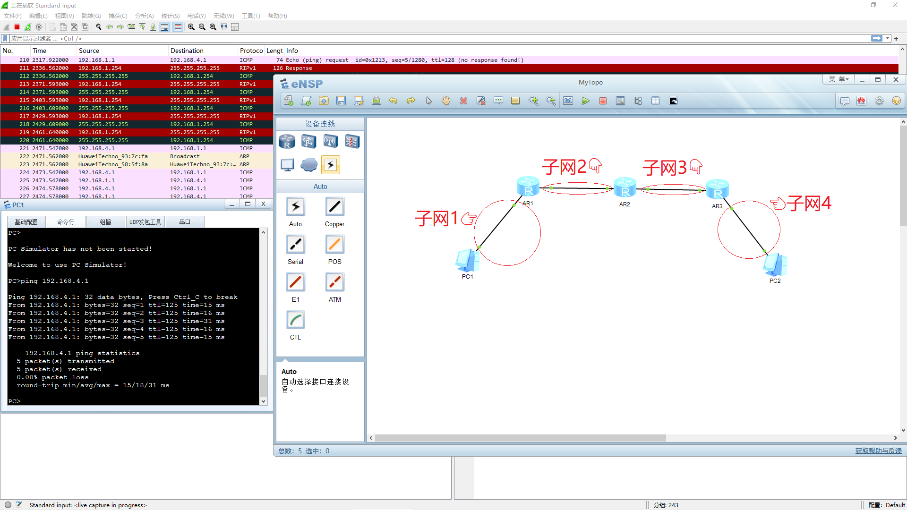

1. PC1 应能 ping PC2，截图如上（左边的终端）。图中网络中共有4个子网，每个子网的地址及掩码如下

   1. 192.168.1.0/24 (掩码: 255.255.255.0)
      - 连接 AR1(G0/0/0: 192.168.1.254) 和 PC1(192.168.1.1)

   2. 192.168.2.0/24 (掩码: 255.255.255.0)  
      - 连接 AR1(G0/0/1: 192.168.2.2) 和 AR2(G0/0/0: 192.168.2.3)

   3. 192.168.3.0/24 (掩码: 255.255.255.0)
      - 连接 AR2(G0/0/1: 192.168.3.2) 和 AR3(G0/0/0: 192.168.3.3)

   4. 192.168.4.0/24 (掩码: 255.255.255.0)
      - 连接 AR3(G0/0/1: 192.168.4.254) 和 PC2(192.168.4.1)

2. 查看各个路由器的中的IP路由表，截图并用红色的框标识出RIP协议产生的路由表项。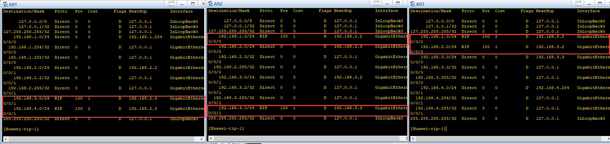

3. 在各个路由器端口进行抓包，观察RIP协议报文，截图举例说明报文各字段的含义。并说明路由器中的IP路由表中的RIP路由表项是如何由RIP协议报文中的距离向量计算得出的，举一个例子即可。

   在AR1的靠近PC1的端口抓包。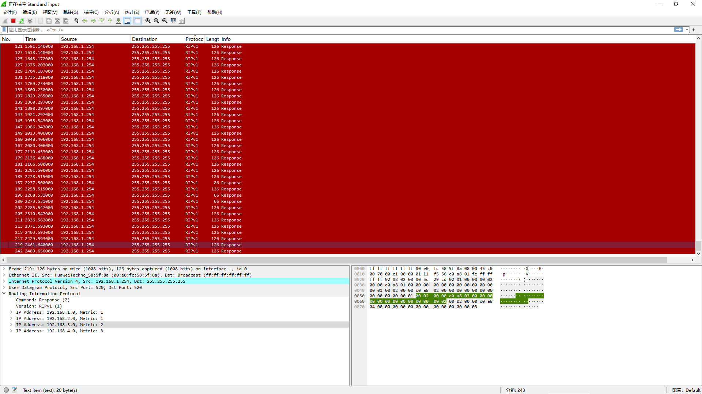

   - RIP报文字段含义

   1. **Command**
      - 值为2表示Response消息
      - 用于路由器之间交换路由信息
      - 其他值：1(Request请求消息)

   2. **Version**
      - 值为1表示RIPv1
      - RIPv1只支持有类路由

   3. **路由条目字段**
      - IP Address: 目的网络地址
      - Metric: 到达该网络的跳数(花费)
      - Metric范围：1-15(16表示不可达)

    - 距离向量计算过程

      以AR2的路由表为例：

    1. **直连路由**：
    - 192.168.2.0/24 (Metric=0)
    - 192.168.3.0/24 (Metric=0)

    2. **RIP学习路由**：
    - 从AR1收到192.168.1.0/24 (Metric=1)
    - 将收到的Metric加1后存入路由表
    - 从AR3收到192.168.4.0/24 (Metric=1)

    3. **更新规则**：
    - 收到路由条目后Metric+1
    - 如果新路由Metric更小则更新
    - 如果下一跳相同则直接更新
    - 超过16跳则丢弃

    所以AR2的路由表显示：
    - 192.168.1.0/24: Metric=1
    - 192.168.4.0/24: Metric=1

    这体现了距离向量的核心思想：路由器只知道到目的网络的"距离"和"方向"。

4. RIP协议中，距离向量的传递是在邻居之间，还是距离向量会直接传播到全网？传递的距离向量是完整的距离向量吗？截图举例说明。
   
   在AR1路由器的AR2方向的出口抓包，每30秒抓到下面2个包：
   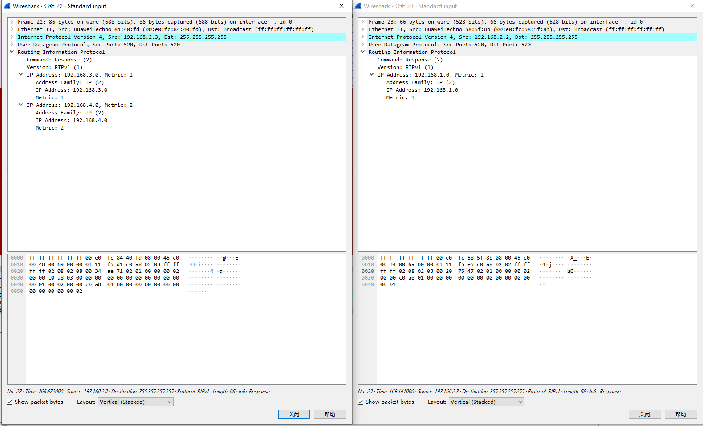

   抓包结果体现了RIP的距离向量传播机制：

    1. **邻居间传递**
    - 这些包是在AR1-AR2之间的链路上抓到的
    - 可以看到两个方向的更新：
    - AR2→AR1：通告192.168.3.0和192.168.4.0
    - AR1→AR2：通告192.168.1.0
    - 没有看到直接来自AR3的更新包，说明是逐跳传递

    1. **完整距离向量**
    - 每个路由器都发送自己完整的路由表：
    - AR2知道的192.168.3.0(Metric=1)和192.168.4.0(Metric=2)都通告给了AR1
    - AR1把自己知道的192.168.1.0(Metric=1)通告给了AR2

    1. **体现距离向量的特征**
    - Metric值反映跳数：
    - 192.168.3.0的Metric=1（AR2直连）
    - 192.168.4.0的Metric=2（AR2经过AR3）
    - 体现了"距离"（跳数）和"方向"（从哪个邻居收到）的特点

    所以这些抓包结果证明RIP是邻居间传递，且每次更新都发送完整的距离向量表

---

### 第二部分：完成以下任务并回答问题

1. 按照要求搭建新的拓扑，完成相关路由器的配置（AR1和AR3的新端口的配置、RIP路由协议的配置）。并在图中指出网络中共有几个子网，每个子网的IP及掩码是什么？

   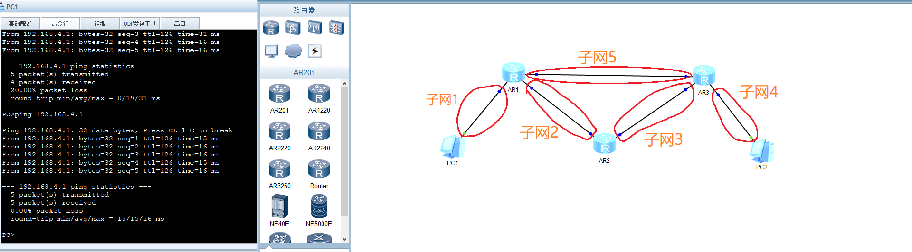

   网络中共有5个子网：

   1. 192.168.1.0/24 (掩码: 255.255.255.0)
      - 连接 AR1(G0/0/0: 192.168.1.254) 和 PC1(192.168.1.1)

   2. 192.168.2.0/24 (掩码: 255.255.255.0)  
      - 连接 AR1(G0/0/1: 192.168.2.2) 和 AR2(G0/0/0: 192.168.2.3)

   3. 192.168.3.0/24 (掩码: 255.255.255.0)
      - 连接 AR2(G0/0/1: 192.168.3.2) 和 AR3(G0/0/0: 192.168.3.3)

   4. 192.168.4.0/24 (掩码: 255.255.255.0)
      - 连接 AR3(G0/0/1: 192.168.4.254) 和 PC2(192.168.4.1)

   5. 192.168.5.0/24 (掩码: 255.255.255.0)
      - 连接 AR1(G0/0/2: 192.168.5.1) 和 AR3(G0/0/2: 192.168.5.2)


2. 观察各个路由器的IP路由表变化，截图AR1和AR3的IP路由表；并在各个路由器端口进行抓包，说明在改变网络拓扑后RIP报文中距离向量的变化，以及该变化如何影响IP路由表，截图并举例说明。

   - AR1的路由表：
   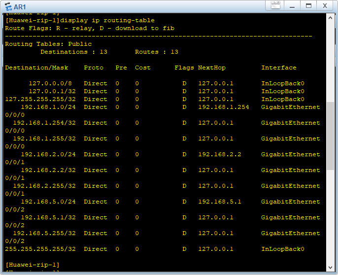

   - AR3的路由表：
   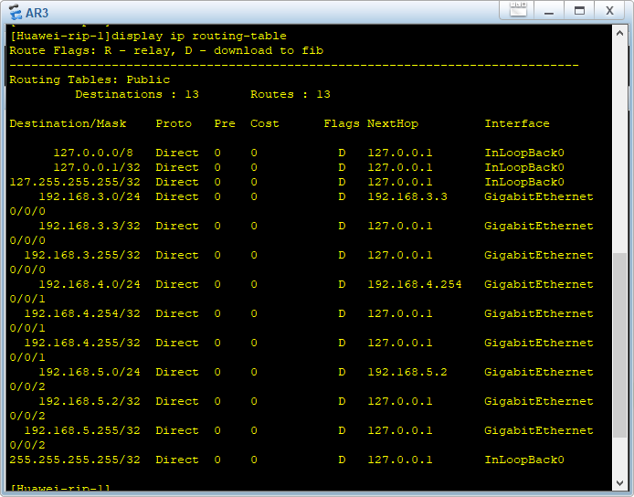

   - 抓包

   按 AR1[0, 1, 2], AR2[0, 1], AR3[0, 1, 2] 的顺序抓包：
   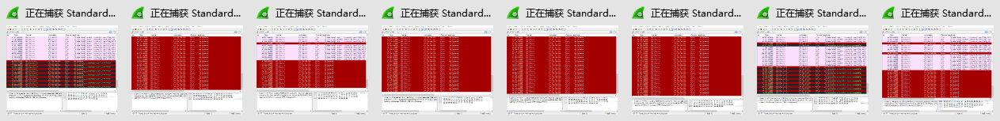
   粉色的是ping的包，红色的是RIP的包。可见已经绕过了AR2。

   - 改变网络拓扑后，RIP报文中距离向量的变化：

   这是 AR1 G0/0/2 接口抓取的RIP包
   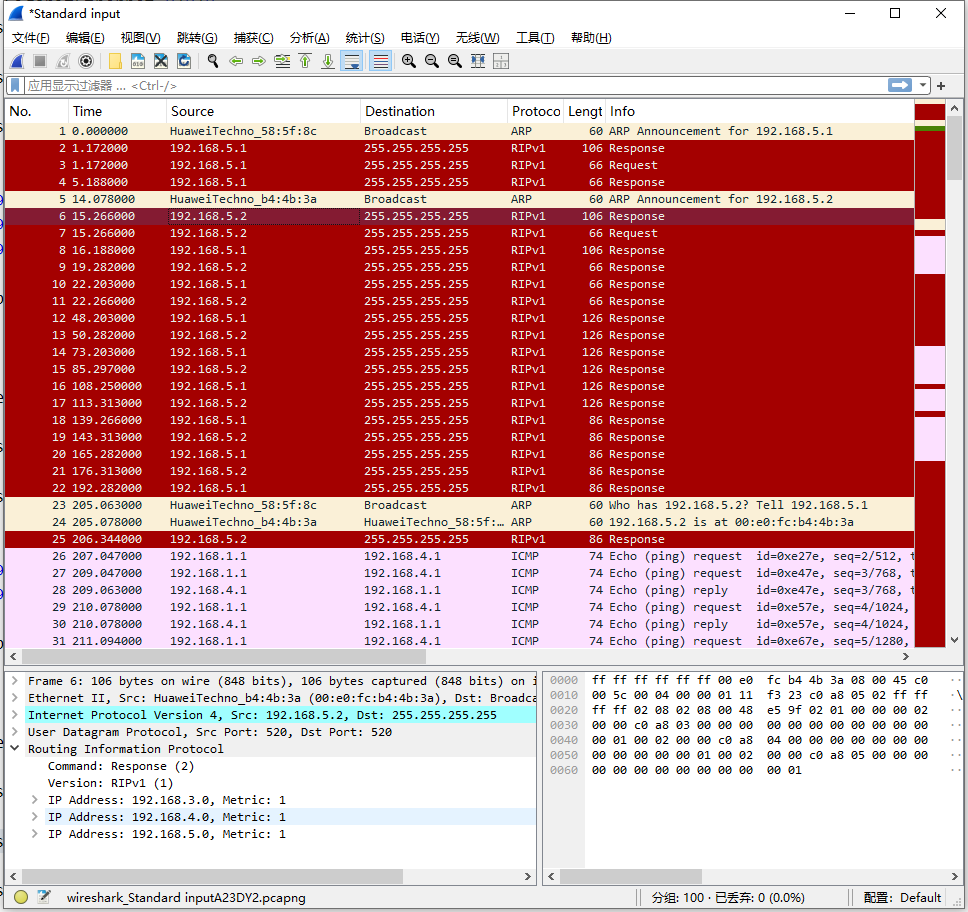
   可以看到`IP Address: 192.168.4.0, Metric: 1 `这一项，说明AR1已经学习到了AR3的路由信息。

   而原先在 AR1 G0/0/1 抓包，RIP收敛后每30秒抓到下面2个包：
   
   其中到子网192.168.4.0/24的Metric是2，说明经过AR2。

   这导致从PC1看来，到PC2的路径发生了变化，从AR1→AR2→AR3变成了AR1→AR3。
   也就是在AR1的G0/0/0接口抓包，可以看到RIP包中192.168.4.0/24的Metric从2变成了1。

   让我根据已有信息来分析这个问题：

   - 对路由表的影响

   RIP选择最小跳数路径，新路径跳数更小(1 < 2)，于是路由表自动更新为新路径

   - **具体变化**
   ```
   变化前的路由：
   192.168.4.0/24  RIP  100  2  D  192.168.2.3  GigabitEthernet0/0/1

   变化后的路由：
   192.168.4.0/24  RIP  100  1  D  192.168.5.2  GigabitEthernet0/0/2
   ```

---

## 任务二：OSPF协议报文观察

按照要求，网络拓扑搭建使用旧的网络拓扑。

1. 按照要求搭建拓扑，完成相关PC与路由器的配置，配置成功PC1应能ping PC2，截图。
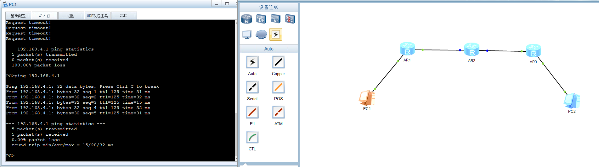

2. 查看各个路由器的中的IP路由表，截图并用红色的框标识出OSPF协议产生的路由表项。
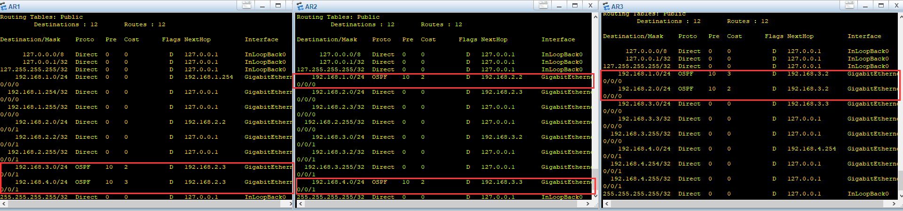

3. 在各个路由器端口进行抓包，观察OSPF协议中LS Update Packet，截图举例说明Router-LSA和Network-LSA各自的作用与区别。并说明路由器中的IP路由表中的OSPF路由表项是如何由OSPF协议报文中的LSA计算得出的，截图并说明。

    ---

    这是在AR2的G0/0/0接口(192.168.2.3)抓取的一个LS Update Packet
   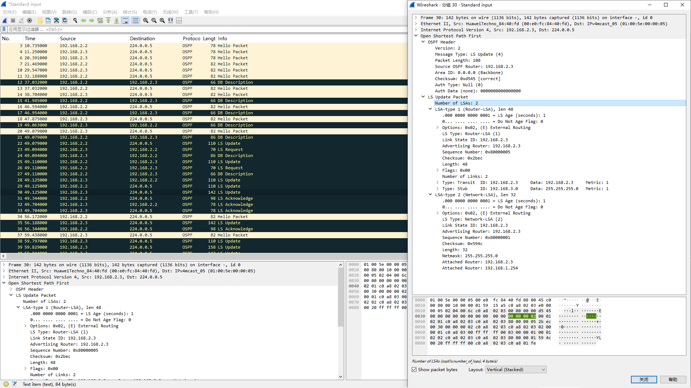

    ### 1. Router-LSA (Type 1)
    - **作用**：描述路由器自身的链路状态信息
    - **关键字段**：
    - Advertising Router: 192.168.2.3 (AR2自己)
    - Number of Links: 2 (有两个链路)
    - Link 1: Transit类型，连接到192.168.2.3
    - Link 2: Stub类型，连接到192.168.3.0

    ### 2. Network-LSA (Type 2)
    - **作用**：描述多路访问网段的信息
    - **关键字段**：
    - Link State ID: 192.168.2.3 (DR的接口IP)
    - Netmask: 255.255.255.0 
    - Attached Router: 列出该网段上的所有路由器
        - 192.168.2.3 (AR2)
        - 192.168.1.254 (AR1)

    ### 主要区别
    1. **产生者**
    - Router-LSA：每台路由器都产生
    - Network-LSA：只有DR路由器产生

    1. **描述内容**
    - Router-LSA：描述路由器自己的所有链路
    - Network-LSA：描述一个网段上的所有邻接关系

    1. **用途**
    - Router-LSA：构建区域拓扑
    - Network-LSA：描述广播网段的连接关系

    这两种LSA共同构建了OSPF的完整网络拓扑图。

    ---

    这是 AR2 CLI 根据OSPF协议计算路由表项时的输出：

    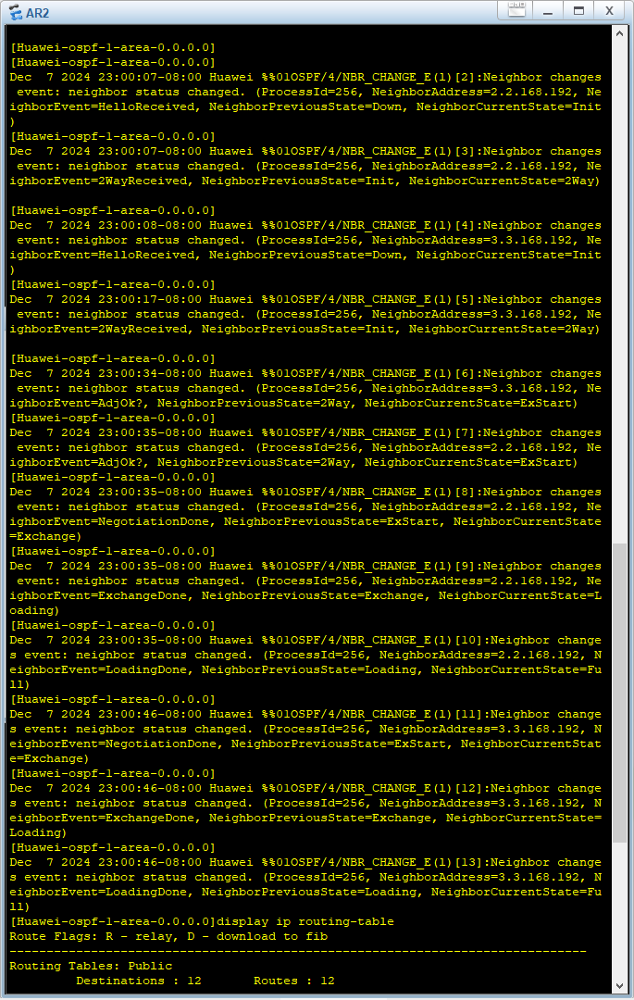

    抓包AR2的两个端口，过滤OSPF协议的update包，可以看到LSA的交换过程。

    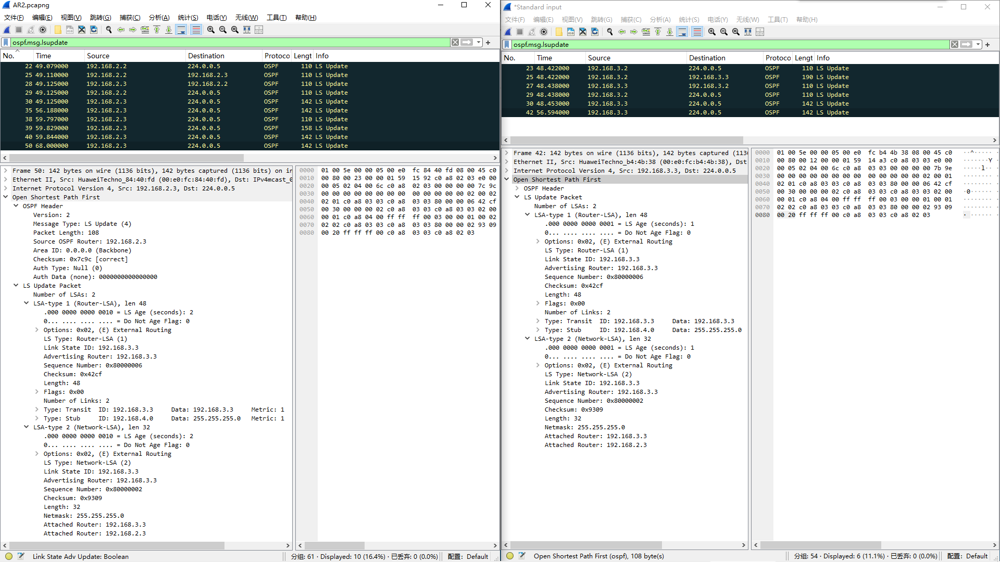

    根据抓包分析OSPF路由计算过程。

    1. **AR2的路由表中的OSPF条目**：
    ```
    192.168.1.0/24  OSPF    10   2    D   192.168.2.2     GigabitEthernet0/0/0
    192.168.4.0/24  OSPF    10   2    D   192.168.3.3     GigabitEthernet0/0/1
    ```

    2. **关键LSA信息**：

    从AR1收到的LSA：
    ```
    Router-LSA (AR1)
    Link State ID: 192.168.1.254
    - Stub: 192.168.1.0/24, Metric=1
    - Transit: 192.168.2.3, Metric=1
    ```

    从AR3收到的LSA：
    ```
    Router-LSA (AR3)
    Link State ID: 192.168.3.3
    - Transit: 192.168.3.3, Metric=1
    - Stub: 192.168.4.0/24, Metric=1
    ```

    3. **Network-LSA信息**：
    ```
    Network-LSA (AR2段)
    - Attached Router: 192.168.2.3 (AR2)
    - Attached Router: 192.168.1.254 (AR1)

    Network-LSA (AR3段)
    - Attached Router: 192.168.3.3 (AR3)
    - Attached Router: 192.168.2.3 (AR2)
    ```

    ### 路由计算过程

    1. **到192.168.1.0/24的路径**：
    - AR2通过Network-LSA知道与AR1相连
    - 从AR1的Router-LSA学习到192.168.1.0/24
    - 计算开销：1(到AR1) + 1(AR1到目标) = 2
    - 下一跳：192.168.2.2

    1. **到192.168.4.0/24的路径**：
    - AR2通过Network-LSA知道与AR3相连
    - 从AR3的Router-LSA学习到192.168.4.0/24
    - 计算开销：1(到AR3) + 1(AR3到目标) = 2
    - 下一跳：192.168.3.3

    这些LSA的交换过程可以在抓包中看到，目的地址224.0.0.5表明是在全网泛洪。

---

4. OSPF协议中的LSA信息传递是在邻居间交换还是在全网传递，截图并说明。

    是**全网传递**。

    从抓包可以看到两种目的地址：
    - 224.0.0.5 (所有OSPF路由器的组播地址)
    - 单播地址 (特定邻居)

    **具体例子**

    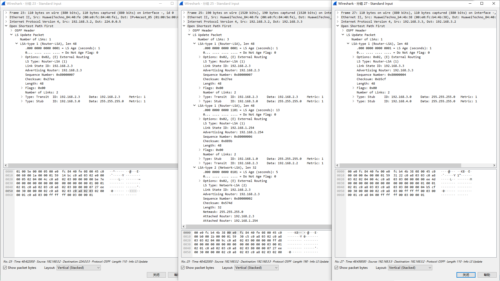

    ```
    分组23: Src: 192.168.3.2 -> Dst: 224.0.0.5
    分组25: Src: 192.168.3.2 -> Dst: 192.168.3.3
    分组27: Src: 192.168.3.3 -> Dst: 192.168.3.2
    ```
