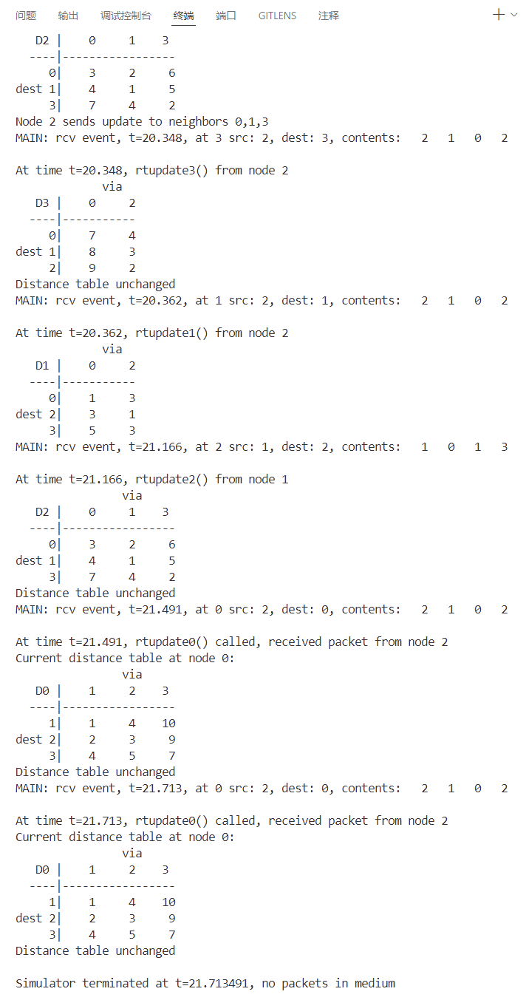

## Part1: 分布式距离路由算法

### 1. 总体架构
每个节点(0-3)都有两个主要函数:
- `rtinit`: 初始化节点的距离表
- `rtupdate`: 处理来自邻居的路由更新

### 2. 关键数据结构
```c
struct distance_table {
  int costs[4][4];  // costs[i][j]表示通过邻居j到达节点i的开销
} dt0;

struct rtpkt {
  int sourceid;     // 发送方ID
  int destid;       // 接收方ID
  int mincost[4];   // 发送方到各节点的最小开销
};
```

### 3. 节点初始化过程(以node0为例)
```c
void rtinit0() {
    // 1. 初始化距离表为无穷大
    for(i = 0; i < 4; i++)
        for(j = 0; j < 4; j++)
            dt0.costs[i][j] = INFINITY;
    
    // 2. 设置直接连接的开销
    dt0.costs[1][1] = 1;    // 到节点1的开销
    dt0.costs[2][2] = 3;    // 到节点2的开销
    dt0.costs[3][3] = 7;    // 到节点3的开销
    
    // 3. 向所有邻居发送初始距离向量
    struct rtpkt packet;
    packet.sourceid = 0;
    // ...发送逻辑...
}
```

### 4. 更新处理过程
```c
void rtupdate0(struct rtpkt *rcvdpkt) {
    // 1. 收到邻居更新后,计算新路径开销
    for(i = 0; i < 4; i++) {
        // 新开销 = 到邻居的开销 + 邻居到目标的开销
        newcost = dt0.costs[rcvdpkt->sourceid][rcvdpkt->sourceid] + 
                 rcvdpkt->mincost[i];
        
        // 如果找到更好的路径,更新距离表
        if(newcost < dt0.costs[i][rcvdpkt->sourceid]) {
            dt0.costs[i][rcvdpkt->sourceid] = newcost;
            changed = 1;
        }
    }
    
    // 2. 如果距离表有更新,通知所有邻居
    if(changed) {
        // 计算到各节点的最小开销
        // 发送更新给邻居
    }
}
```

### 5. 链路成本变化处理
```c
void linkhandler0(int linkid, int newcost) {
    // 1. 更新直接链路成本
    dt0.costs[linkid][linkid] = newcost;
    
    // 2. 重新计算最小开销并通知邻居
    // ...类似rtupdate的逻辑...
}
```

### 结果


## Part2: RIP和OSPF路由协议观察

