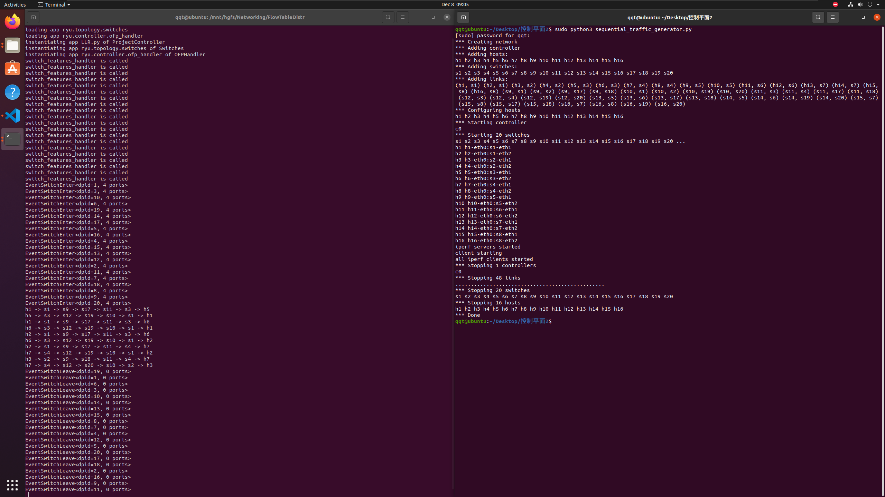

# Lab 7：网络层控制平面流表下发

实现三种路由算法（LPR、RSR、LLR）并在 Fat-Tree 拓扑上测试。

## 共同部分

基于 FatTree 网络拓扑。

### 1. 初始化

按图配置网络拓扑，即配置每个节点的父节点编号，以及到达某IP地址的下一跳节点编号。

```python
self.father = {1: (9, 10), 2: (9, 10), 3: (11, 12), 4: (11, 12), 5: (13, 14), 6: (13, 14), 7: (15, 16), 8: (15, 16), 9: (17, 18), 10: (19, 20), 11: (17, 18), 12: (19, 20), 13: (17, 18), 14: (19, 20), 15: (17, 18), 16: (19, 20)}
self.ip_son = {9: {"10.0.0.1": 1, "10.0.0.2": 1, "10.0.0.3": 2, "10.0.0.4": 2}, ..., 20: {...} }

x = something  # 学号后两位
mod = lambda x: x % 16 if x % 16 != 0 else 16
src = '10.0.0.%d' % mod(x)
dst1 = '10.0.0.%d' % mod(x + 4)
dst2 = '10.0.0.%d' % mod(x + 5)

self.key = [(src, dst1), (src, dst2)]
```

### 2. 流表下发

在`_packet_in_handler(self, ev)`函数中，根据不同的包类型，设置不同的匹配规则和动作。

```python
# IP 包匹配
match = parser.OFPMatch(
    eth_type=ether_types.ETH_TYPE_IP,
    in_port=in_port,
    ipv4_src=src,
    ipv4_dst=dst,
)

# ARP 包匹配
match = parser.OFPMatch(
    eth_type=ether_types.ETH_TYPE_ARP,
    in_port=in_port,
    arp_spa=src,
    arp_tpa=dst,
)

# 动作
out_port = self.get_nxt(dpid, src, dst)
actions = [datapath.ofproto_parser.OFPActionOutput(out_port)]
```

### 3. 端口确定

通过`get_nxt(self, dpid, src, dst)`函数确定下一跳端口。

如果请求的路径没有计算过，就以cal_path计算之。

遍历 path 找到 dpid 所在的位置。  
如果不是最后一个位置，那么输出其到下一跳的端口号。
否则直接输出到达目的主机的端口号。

若发生KeyError，则当前节点不是目的节点的父节点，需要后续处理。

```python
def get_nxt(self, dpid, src, dst):
    if (src, dst) not in self.path:
        self.cal_path(src, dst)
    path = self.path[(src, dst)]
    for i in range(len(path)):
        if path[i] == dpid:
            if i == len(path) - 1:
                return self.hosts[dst][1]
            try:
                return self.adjacency[dpid][path[i + 1]]
            except KeyError:
                return ofproto_v1_3.OFPP_FLOOD
    return ofproto_v1_3.OFPP_FLOOD
```

## Left Path Routing (LPR)

```python
    def cal_path(self, src, dst):
        dpid = self.hosts[src][0]
        while True:
            self.path[(src, dst)].append(dpid)
            if 1 <= dpid <= 8:
                if self.hosts[dst][0] == dpid:
                    break
                else:
                    dpid = self.father[dpid][0] # 始终选择最左边的父节点
            elif dst in self.ip_son[dpid]:
                dpid = self.ip_son[dpid][dst] # 预先配置为最左边的儿子节点
            else:
                dpid = self.father[dpid][0] # 始终选择最左边的父节点
```

### 分析

循环查找。第一跳从连接src主机的路由器直接获取。

如果当前路由器是叶子层(1 <= dpid <= 8)且目标路由器在其下，说明这就是最后一跳，直接输出到达目的主机的端口号。
否则，选择最左边的父节点。  
若当前路由器的子节点中有目标路由器，那么直接输出到达目的主机的端口号，它已经被预先配置为最左边的儿子节点。

### 结果


    h2 -> s1 -> s9 -> s17 -> s11 -> s3 -> h6
    h2 -> s1 -> s9 -> s17 -> s11 -> s4 -> h7


## Random Selection Routing (RSR)

```python
def cal_path(self, src, dst):
    dpid = self.hosts[src][0]
    while True:
        self.path[(src, dst)].append(dpid)
        if 1 <= dpid and dpid <= 8:
            if self.hosts[dst][0] == dpid:
                break
            else:
                dpid = self.father[dpid][random.randint(0, 1)] # 随机选择父节点
        elif dst in self.ip_son[dpid]:
                dpid = self.ip_son[dpid][dst] # 分析见下
            else:
                dpid = self.father[dpid][random.randint(0, 1)] # 随机选择父节点
```

### 分析

循环查找的逻辑与LPR相同，只是在选择父节点时，随机选择一个。

p.s. 由于本实验中只查找 x 到(x+4)和(x+5)的路径，所以必然经过核心层；核心层的交换机到其下一层的某连通区域的链路只有1条，所以ip_son中的值只能有一个，也就不存在随机选择的问题。

### 结果

测了几次，体现随机性。


    h2 -> s1 -> s9 -> s17 -> s11 -> s3 -> h6
    h2 -> s1 -> s9 -> s18 -> s11 -> s4 -> h7


    h2 -> s1 -> s9 -> s18 -> s11 -> s3 -> h6
    h2 -> s1 -> s10 -> s19 -> s12 -> s4 -> h7


另有一次没截图。

    h2 -> s1 -> s10 -> s20 -> s12 -> s3 -> h6
    h2 -> s1 -> s9 -> s18 -> s11 -> s4 -> h7

## Least Loaded Routing (LLR)

```python
def cal_path(self, src, dst):
    dpid1 = self.hosts[src][0]
    dpid2 = self.hosts[dst][0]

    def max_link(dpid: int, ip1: str, ip2: str):
        return max(self.cal_cost(dpid, ip1), self.cal_cost(dpid, ip2))

    if dpid1 == dpid2:
        self.path[(src, dst)] = [dpid1]
    elif self.father[dpid1] == self.father[dpid2]:
        fa = self.father[dpid1]
        mid = fa[0] if max_link(fa[0], src, dst) <= max_link(fa[1], src, dst) else fa[1]
        self.path[(src, dst)] = [dpid1, mid, dpid2]
    else:
        mindpid = min(range(17, 21), key=lambda i: max_link(i, src, dst))
        self.path[(src, dst)] = [
            dpid1,
            self.ip_son[mindpid][src],
            mindpid,
            self.ip_son[mindpid][dst],
            dpid2,
        ]

    path = self.path[(src, dst)]
    for i in range(len(path) - 1):
        self.costs[(path[i], path[i + 1])] += 1
        self.costs[(path[i + 1], path[i])] += 1
```

### 分析

首先，如果源和目的主机在同一个路由器上，直接输出路径。  
如果源和目的主机在同一个父节点下，那么选择两个父节点中负载较小的那个。  
否则，选择负载最小的核心层交换机，然后选择到达源和目的主机的路径。

最后，更新路径的负载。

`≤`和`min()`保证了负载相同时，选择编号较小的交换机，以符合LPR原则。

### 结果

测了两次。


    h1 -> s1 -> s9 -> s17 -> s11 -> s3 -> h5
    h5 -> s3 -> s12 -> s19 -> s10 -> s1 -> h1
    h1 -> s1 -> s9 -> s17 -> s11 -> s3 -> h6
    h6 -> s3 -> s12 -> s19 -> s10 -> s1 -> h1
    h2 -> s1 -> s9 -> s17 -> s11 -> s3 -> h6
    h6 -> s3 -> s12 -> s19 -> s10 -> s1 -> h2
    h2 -> s1 -> s9 -> s17 -> s11 -> s4 -> h7
    h7 -> s4 -> s12 -> s19 -> s10 -> s1 -> h2
    h3 -> s2 -> s9 -> s18 -> s11 -> s4 -> h7
    h7 -> s4 -> s12 -> s20 -> s10 -> s2 -> h3

