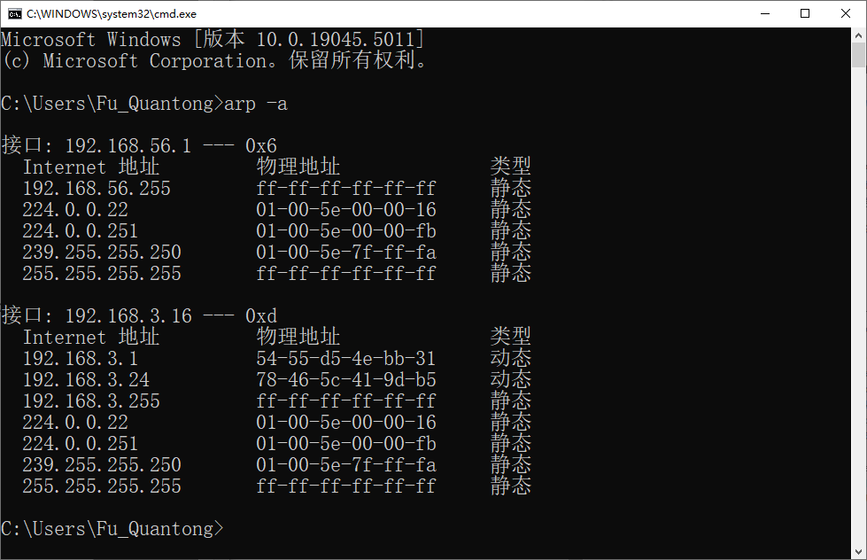
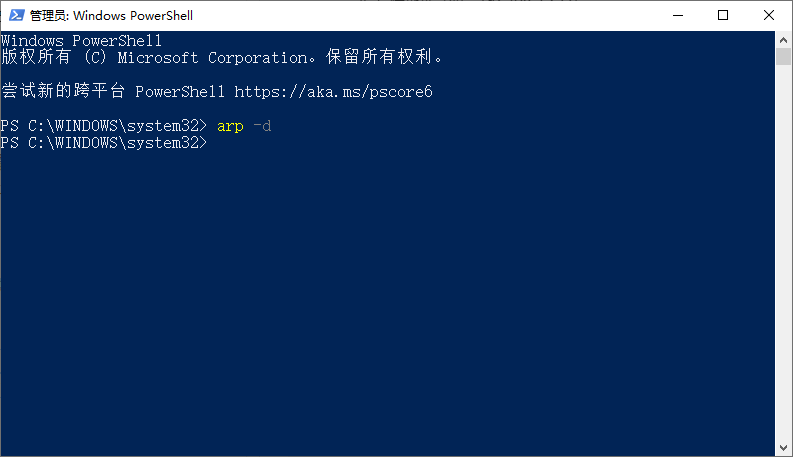

# Lab 8：链路层观察

## 一、实验任务一：Ethernet帧观察

### 选中包含HTTP GET消息的以太网帧，回答以下问题：

```
No.     Time           Source                Destination           Protocol Length Info
     47 6.598035       192.168.3.16          128.119.245.12        HTTP     529    GET /wireshark-labs/HTTP-ethereal-lab-file3.html HTTP/1.1 

Frame 47: 529 bytes on wire (4232 bits), 529 bytes captured (4232 bits)
Ethernet II, Src: Intel_0a:1c:f2 (60:f2:62:0a:1c:f2), Dst: HuaweiDevice_4e:bb:31 (54:55:d5:4e:bb:31)
Internet Protocol Version 4, Src: 192.168.3.16, Dst: 128.119.245.12
Transmission Control Protocol, Src Port: 7384, Dst Port: 80, Seq: 1, Ack: 1, Len: 475
Hypertext Transfer Protocol
    GET /wireshark-labs/HTTP-ethereal-lab-file3.html HTTP/1.1\r\n
    Host: gaia.cs.umass.edu\r\n
    Connection: keep-alive\r\n
    Upgrade-Insecure-Requests: 1\r\n
    User-Agent: Mozilla/5.0 (Windows NT 10.0; Win64; x64) AppleWebKit/537.36 (KHTML, like Gecko) Chrome/131.0.0.0 Safari/537.36\r\n
    Accept: text/html,application/xhtml+xml,application/xml;q=0.9,image/avif,image/webp,image/apng,*/*;q=0.8,application/signed-exchange;v=b3;q=0.7\r\n
    Accept-Encoding: gzip, deflate\r\n
    Accept-Language: zh-CN,zh;q=0.9\r\n
    \r\n
    [Response in frame: 56]
    [Full request URI: http://gaia.cs.umass.edu/wireshark-labs/HTTP-ethereal-lab-file3.html]

```

1. **你的电脑的mac地址是多少？**
   - 源MAC地址 60:f2:62:0a:1c:f2 (Intel_0a:1c:f2) 就是电脑的MAC地址

2. **以太网帧的目标mac地址是多少？这个地址是gaia.cs.umass.edu的mac地址吗？**
   - 目标MAC地址是：54:55:d5:4e:bb:31 (HuaweiDevice_4e:bb:31)
   - 这不是gaia.cs.umass.edu的MAC地址，而是本地网络中华为路由器的MAC地址

3. **以太网帧EtherType字段值是多少，对应着什么协议？**
   - EtherType字段值是：0x0800
   - 对应IPv4协议

4. **从以太网帧的开始到"GET"中的'G'出现，有多少字节？**
   - 以太网头部：14字节
   - IP头部：20字节
   - TCP头部：20字节
   - 所以从以太网帧开始到"GET"的'G'总共是：14 + 20 + 20 = 54字节

### 选中第一个包含HTTP响应消息的以太网帧，回答以下问题：

```
No.     Time           Source                Destination           Protocol Length Info
     56 6.814233       128.119.245.12        192.168.3.16          HTTP     679    HTTP/1.1 200 OK  (text/html)

Frame 56: 679 bytes on wire (5432 bits), 679 bytes captured (5432 bits)
Ethernet II, Src: HuaweiDevice_4e:bb:31 (54:55:d5:4e:bb:31), Dst: Intel_0a:1c:f2 (60:f2:62:0a:1c:f2)
Internet Protocol Version 4, Src: 128.119.245.12, Dst: 192.168.3.16
Transmission Control Protocol, Src Port: 80, Dst Port: 7384, Seq: 4237, Ack: 476, Len: 625
[4 Reassembled TCP Segments (4861 bytes): #53(1412), #54(1412), #55(1412), #56(625)]
Hypertext Transfer Protocol
    HTTP/1.1 200 OK\r\n
    Date: Sun, 22 Dec 2024 10:42:31 GMT\r\n
    Server: Apache/2.4.6 (CentOS) OpenSSL/1.0.2k-fips PHP/7.4.33 mod_perl/2.0.11 Perl/v5.16.3\r\n
    Last-Modified: Sun, 22 Dec 2024 06:59:01 GMT\r\n
    ETag: "1194-629d66a2de012"\r\n
    Accept-Ranges: bytes\r\n
    Content-Length: 4500\r\n
    Keep-Alive: timeout=5, max=100\r\n
    Connection: Keep-Alive\r\n
    Content-Type: text/html; charset=UTF-8\r\n
    \r\n
    [Request in frame: 47]
    [Time since request: 0.216198000 seconds]
    [Request URI: /wireshark-labs/HTTP-ethereal-lab-file3.html]
    [Full request URI: http://gaia.cs.umass.edu/wireshark-labs/HTTP-ethereal-lab-file3.html]
    File Data: 4500 bytes
Line-based text data: text/html (98 lines)

```

1. **这个以太网帧中，源mac地址是多少？拥有这个以太网地址的设备是什么？**
   - 源MAC地址是：54:55:d5:4e:bb:31 (HuaweiDevice_4e:bb:31)
   - 这是华为路由器的MAC地址

2. **这个以太网帧中，目的mac地址是多少？拥有这个以太网地址的设备是什么？**
   - 目的MAC地址是：60:f2:62:0a:1c:f2 (Intel_0a:1c:f2)
   - 这是我的电脑（Intel网卡）的MAC地址

3. **以太网帧EtherType字段值是多少，对应着什么协议？**
   - EtherType字段值是：0x0800
   - 对应IPv4协议

4. **从以太网帧的开始到"OK"中的'O'出现，有多少字节？**
    - 以太网头部：14字节
    - IP头部：20字节
    - TCP头部：20字节
    - HTTP响应头开始到"OK"中的'O'：9字节（"HTTP/1.1 "）
   - 总共是：14 + 20 + 20 + 9 = 63字节

## 二、实验任务二：ARP

### 查看ARP缓存

- 列出ARP缓存的内容(截图)，每列表示什么意思？
  


```
接口: 192.168.56.1 --- 0x6
  Internet 地址         物理地址              类型
  192.168.56.255        ff-ff-ff-ff-ff-ff     静态
  224.0.0.22            01-00-5e-00-00-16     静态
  224.0.0.251           01-00-5e-00-00-fb     静态
  239.255.255.250       01-00-5e-7f-ff-fa     静态
  255.255.255.255       ff-ff-ff-ff-ff-ff     静态

接口: 192.168.3.16 --- 0xd
  Internet 地址         物理地址              类型
  192.168.3.1           54-55-d5-4e-bb-31     动态
  192.168.3.24          78-46-5c-41-9d-b5     动态
  192.168.3.255         ff-ff-ff-ff-ff-ff     静态
  224.0.0.22            01-00-5e-00-00-16     静态
  224.0.0.251           01-00-5e-00-00-fb     静态
  239.255.255.250       01-00-5e-7f-ff-fa     静态
  255.255.255.255       ff-ff-ff-ff-ff-ff     静态
```

ARP缓存表中每列的含义：

1. **接口（Interface）**:
   - 显示本地网卡的IP地址和接口标识符
   - 例如：`192.168.56.1 --- 0x6` 和 `192.168.3.16 --- 0xd` 是两个不同的网络接口

2. **Internet 地址（IP Address）**:
   - 网络中设备的IP地址
   - 包括：
     - 单播地址（如：192.168.3.1）
     - 广播地址（如：192.168.3.255）
     - 多播地址（如：224.0.0.22）

3. **物理地址（MAC Address）**:
   - 对应设备的MAC地址
   - 特殊MAC地址：
     - `ff-ff-ff-ff-ff-ff` 是广播MAC地址
     - `01-00-5e` 开头的是多播MAC地址

4. **类型（Type）**:
   - `动态`: 通过ARP协议动态学习到的映射关系，会随时间老化
   - `静态`: 手动配置或系统预设的映射关系，永久保存

### 清除计算机上ARP缓存




### 抓取并观察ARP包，回答以下问题： 

第一个ARP请求包是从我的电脑发送的，请求的是网关的MAC地址：

```
No.     Time           Source                Destination           Protocol Length Info
      8 2.922636       Intel_0a:1c:f2        Broadcast             ARP      42     Who has 192.168.3.1? Tell 192.168.3.16

Frame 8: 42 bytes on wire (336 bits), 42 bytes captured (336 bits) on interface \Device\NPF_{92F2EE31-EABA-454F-8B7B-195009303DEF}, id 0
Ethernet II, Src: Intel_0a:1c:f2 (60:f2:62:0a:1c:f2), Dst: Broadcast (ff:ff:ff:ff:ff:ff)
    Destination: Broadcast (ff:ff:ff:ff:ff:ff)
        .... ..1. .... .... .... .... = LG bit: Locally administered address (this is NOT the factory default)
        .... ...1 .... .... .... .... = IG bit: Group address (multicast/broadcast)
    Source: Intel_0a:1c:f2 (60:f2:62:0a:1c:f2)
        .... ..0. .... .... .... .... = LG bit: Globally unique address (factory default)
        .... ...0 .... .... .... .... = IG bit: Individual address (unicast)
    Type: ARP (0x0806)
    [Stream index: 1]
Address Resolution Protocol (request)
    Hardware type: Ethernet (1)
    Protocol type: IPv4 (0x0800)
    Hardware size: 6
    Protocol size: 4
    Opcode: request (1)
    Sender MAC address: Intel_0a:1c:f2 (60:f2:62:0a:1c:f2)
    Sender IP address: 192.168.3.16
    Target MAC address: 00:00:00_00:00:00 (00:00:00:00:00:00)
    Target IP address: 192.168.3.1

```

1. 第一个包含ARP请求信息的以太网帧中，源和目的mac地址为？ 

    源MAC：60:f2:62:0a:1c:f2 (Intel_0a:1c:f2)
    目的MAC：ff:ff:ff:ff:ff:ff (Broadcast)

2. 以太网帧EtherType字段值是多少，对应着什么协议？

    值：0x0806
    对应：ARP协议

### 参考ARP规范，回答以下问题： 

1. ARP操作字段在以太网帧的第几个字节？ 

    从以太网帧开始数第21字节起的2字节

    以太网头部14字节 + ARP头部（硬件类型2字节+协议类型2字节+硬件长度1字节+协议长度1字节+操作码2字节）

2. 进行ARP请求的以太网帧中，ARP负载部分操作字段值是多少？

    Opcode: request (1)

3. ARP消息是否包含发送方的IP地址？ 

    包含，Sender IP address: 192.168.3.16

4. 在ARP请求中从哪里看出我们想查询相应IP的mac地址?

    通过Target IP address字段，表示想查询192.168.3.1的MAC地址

### 找到ARP请求对应的回应包，回答以下问题： 

```
No.     Time           Source                Destination           Protocol Length Info
      9 2.924110       HuaweiDevice_4e:bb:31 Intel_0a:1c:f2        ARP      42     192.168.3.1 is at 54:55:d5:4e:bb:31

Frame 9: 42 bytes on wire (336 bits), 42 bytes captured (336 bits) on interface \Device\NPF_{92F2EE31-EABA-454F-8B7B-195009303DEF}, id 0
Ethernet II, Src: HuaweiDevice_4e:bb:31 (54:55:d5:4e:bb:31), Dst: Intel_0a:1c:f2 (60:f2:62:0a:1c:f2)
    Destination: Intel_0a:1c:f2 (60:f2:62:0a:1c:f2)
        .... ..0. .... .... .... .... = LG bit: Globally unique address (factory default)
        .... ...0 .... .... .... .... = IG bit: Individual address (unicast)
    Source: HuaweiDevice_4e:bb:31 (54:55:d5:4e:bb:31)
        .... ..0. .... .... .... .... = LG bit: Globally unique address (factory default)
        .... ...0 .... .... .... .... = IG bit: Individual address (unicast)
    Type: ARP (0x0806)
    [Stream index: 0]
Address Resolution Protocol (reply)
    Hardware type: Ethernet (1)
    Protocol type: IPv4 (0x0800)
    Hardware size: 6
    Protocol size: 4
    Opcode: reply (2)
    Sender MAC address: HuaweiDevice_4e:bb:31 (54:55:d5:4e:bb:31)
    Sender IP address: 192.168.3.1
    Target MAC address: Intel_0a:1c:f2 (60:f2:62:0a:1c:f2)
    Target IP address: 192.168.3.16

```

1. ARP操作字段在以太网帧的第几个字节？ 

    同上，第21字节起的2字节

2. 进行ARP响应的以太网帧中，ARP负载部分操作字段值是多少？ 

    Opcode: reply (2)

3. ARP回应之前请求信息的内容？ 

    Sender MAC address: HuaweiDevice_4e:bb:31 (54:55:d5:4e:bb:31)

4. 包含ARP回应信息的以太网帧中，源和目的mac地址为？

    源MAC：54:55:d5:4e:bb:31 (HuaweiDevice_4e:bb:31)
    目的MAC：60:f2:62:0a:1c:f2 (Intel_0a:1c:f2)