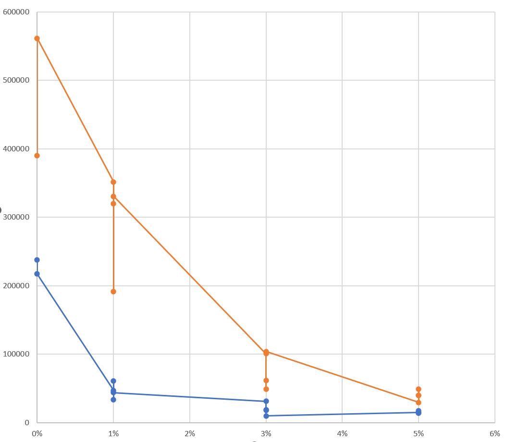
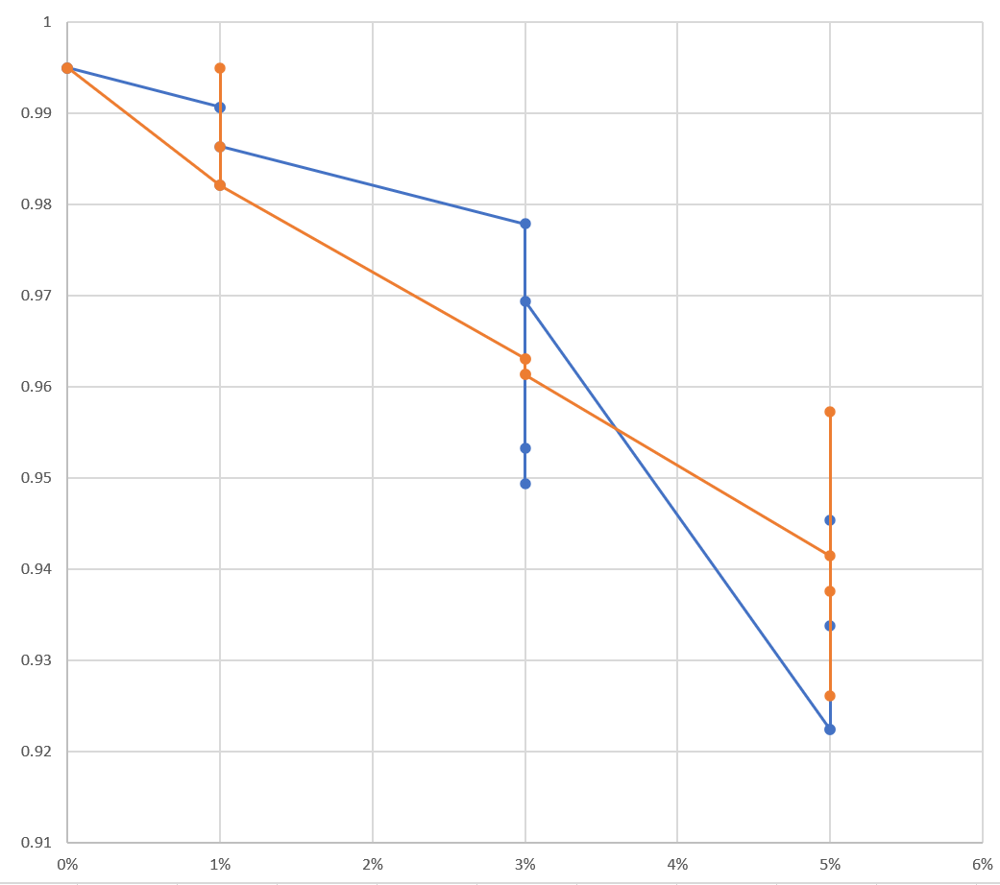
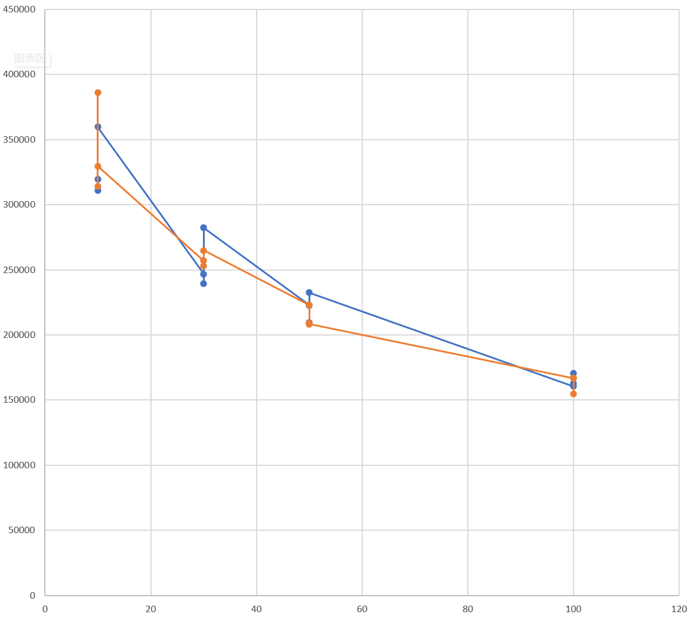
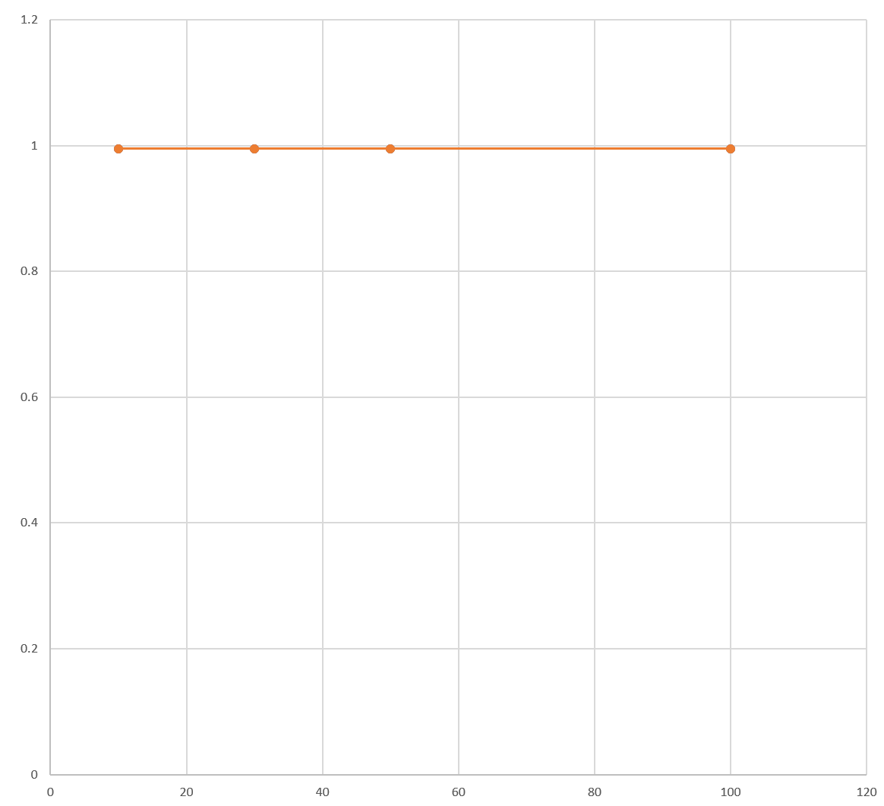
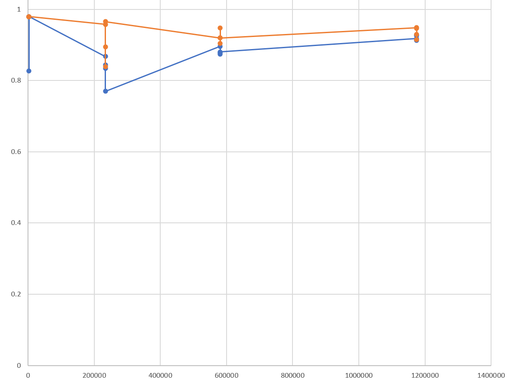
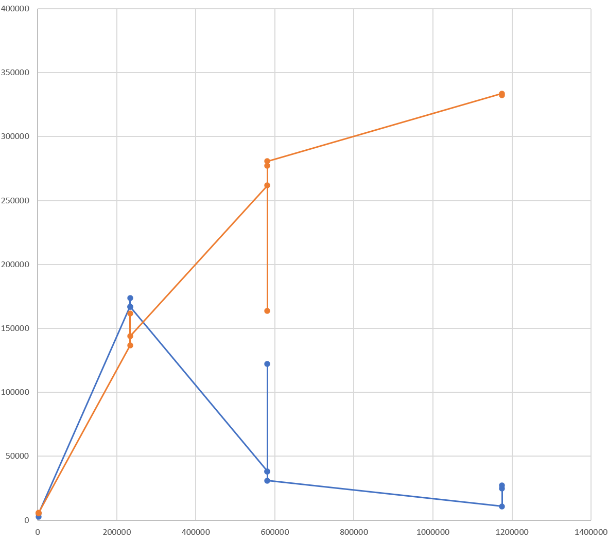

# 基于UDP的可靠传输  程序设计与测试报告

## 一、设计思路

本次实验的目标是实现一个基于 UDP 的可靠文件传输程序，支持以下功能：

1. **可靠数据传输协议**：实现 **GBN（Go-Back-N）** 和 **SR（Selective Repeat）** 两种协议，以处理数据包的丢失、重复和乱序。
2. **拥塞控制算法**：实现 **Reno** 和 **Vegas** 两种拥塞控制算法，以优化传输性能。
3. **文件传输功能**：支持客户端与服务器之间的文件上传和下载操作。

为实现上述目标，程序设计的总体思路如下：

- **模块化设计**：将程序分为发送端（Sender）、接收端（Receiver）、拥塞控制（Congestion Control）、以及协议实现（GBN/SR）的独立模块，以提高代码的可读性和可维护性。
- **面向对象编程**：使用类和对象封装相关功能，如 `Sender`、`GBNReceiver`、`SRReceiver`、`Reno`、`Vegas` 等类，以便更好地管理状态和方法。
- **多线程处理**：在发送端，使用独立的线程处理数据发送和 ACK 接收，以提高传输效率。
- **灵活的参数配置**：客户端和服务器可以根据需要选择不同的传输协议（GBN/SR）和拥塞控制算法（Reno/Vegas）。

## 二、实现细节

### 1. 可靠数据传输协议

    在`retransmission_protocol.py`中实现了GBN和SR协议的发送端逻辑，包括数据发送、ACK接收、超时重传等功能。

#### **GBN（Go-Back-N）协议**

- **发送端**：
  - 维护一个发送窗口，窗口大小由拥塞控制算法动态调整。
  - 当窗口未满且有待发送的数据包时，继续发送数据包。
  - 设置定时器，当超过超时时间未收到对应的 ACK 时，重传从 `base` 开始的所有未确认数据包。
  
- **接收端**：
  - 只接受按序到达的数据包，对于不符合期望序号的包直接丢弃。
  - 发送对已接受数据包的 ACK，告知发送端。

#### **SR（Selective Repeat）协议**

- **发送端**：
  - 维护一个发送窗口，同样由拥塞控制算法动态调整。
  - 对于每个已发送的数据包，分别设置定时器，若超时未收到对应的 ACK，则仅重传该数据包。
  
- **接收端**：
  - 接收窗口内的任何数据包都接受，并缓存乱序到达的数据包。
  - 对每个接收到的数据包发送对应的 ACK。
  - 当收到期望序号的数据包时，提交给上层，并检查缓存中是否有后续按序的数据包。

### 2. 拥塞控制算法

    在`congestion_control.py`中实现了Reno和Vegas两种拥塞控制算法，用于动态调整发送窗口大小。

#### **Reno**

- **基本思想**：
  - 使用 **慢启动** 和 **拥塞避免** 机制，根据网络状况动态调整拥塞窗口（cwnd）的大小。
  - **快速重传** 和 **快速恢复** 机制，用于应对数据包的丢失。
  
- **实现细节**：
  - **慢启动阶段**：每收到一个新的 ACK，窗口大小加 1。
  - **拥塞避免阶段**：当窗口大小超过慢启动阈值（ssthresh）时，每个 RTT 内窗口大小加 1。
  - **丢包处理**：发生超时或收到 3 次重复 ACK，触发快速重传，调整 ssthresh 和窗口大小。

#### **Vegas**

- **基本思想**：
  - 通过测量实际的发送速率与预期速率之间的差异，来调整窗口大小。
  - 更加注重网络的包延迟，以避免网络发生拥塞。
  
- **实现细节**：
  - 计算 **BaseRTT**（最小 RTT）和 **ActualRTT**（实际 RTT），估计网络的拥塞程度。
  - 根据差值 `diff` 调整窗口大小：
    - 当 `diff < α` 时，增加窗口大小。
    - 当 `diff > β` 时，减小窗口大小。
    - 否则，保持窗口大小不变。

### 3. 文件传输流程

#### **客户端与服务器交互**

- **握手阶段**：
  - 客户端发送包含操作类型、文件名、协议和拥塞控制算法的握手消息到服务器固定端口。
  - 服务器接收握手消息后，为客户端分配新的端口，并将新端口号发送回客户端。
  
- **数据传输阶段**：
  - **上传**：
    - 客户端作为发送端，读取待上传的文件，使用选择的协议和拥塞控制算法将文件发送给服务器。
    - 服务器作为接收端，接收并保存文件。
  
  - **下载**：
    - 服务器作为发送端，读取待下载的文件，使用选择的协议和拥塞控制算法将文件发送给客户端。
    - 客户端作为接收端，接收并保存文件。

### 4. 代码结构

- **`ftpclient.py`**：客户端主程序，处理用户输入，发送握手消息，调用上传或下载函数。
- **`ftpserver.py`**：服务器主程序，接收握手消息，分配新端口，启动上传或下载处理。
- **`ftpsender.py`**：发送端实现，包含 `Sender` 类，处理数据发送、ACK 接收、拥塞控制等功能。
- **`ftpreceiver.py`**：接收端实现，包含 `GBNReceiver` 和 `SRReceiver` 类，处理数据接收和 ACK 发送。
- **`util.py`**：工具模块，包含 `upload` 和 `download` 函数，根据操作类型调用相应的发送端或接收端类。
- **`retransmission_protocol.py`**：重传协议实现，定义了 `GBN` 和 `SR` 协议的发送端 ACK 接收逻辑。
- **`congestion_control.py`**：拥塞控制算法实现，定义了 `Reno` 和 `Vegas` 类，提供窗口调整的策略。

## 三、测试方案

### 1. 测试环境

    公网操作涉及NAT，为简单起见，`ftpserver.py` 使用单线程单次请求的方式，处理后即退出。
    当处于同一局域网时，可使用`server.py`多线程处理多个请求。

- **服务器端**：公网 IP 服务器，运行 `ftpserver.py`。
- **客户端**：本地计算机，运行 `ftpclient.py`。

### 2. 测试方法

- 使用不同的协议（GBN/SR）和拥塞控制算法（Reno/Vegas），传输不同大小的文件。
- 调整丢包率，模拟网络不良环境。
- 记录传输的总时间、总发送字节数、吞吐量、流量利用率、丢包数等数据。

### 3. 测试结果

#### **测试数据摘录（来自 `stat.log`）**

    前6项文件长度为定值234059字节。

1. 有效吞吐量(Byte/s) 随 丢包率(%) 变化
   - **GBN + Reno** （蓝色）对比 **SR + Reno**（橙色）

    

2. 流量利用率(%) 随 丢包率(%) 变化
  - **GBN + Reno** （蓝色）对比 **SR + Reno**（橙色）

    

3. 有效吞吐量(Byte/s) 随 丢包率(%) 变化
  - **SR + Reno** （橙色）对比 **SR + Vegas**（蓝色）

    

4. 流量利用率(%) 随 丢包率(%) 变化
  - **SR + Reno** （橙色）对比 **SR + Vegas**（蓝色）

    

5. 有效吞吐量(Byte/s) 随 延迟(ms ± 10%) 变化
  - **SR + Reno** （蓝色）对比 **SR + Vegas**（橙色）

    

6. 流量利用率(%) 随 延迟(ms ± 10%) 变化
  - **SR + Reno** （蓝色）对比 **SR + Vegas**（橙色）

    丢包率是 0%，文件长度恒定，所以流量利用率不变
    

7. 有效吞吐量(Byte/s) 随 上传文件大小(Byte) 变化
  - **GBN + Reno** （蓝色）对比 **SR + Reno**（橙色）

    

8. 流量利用率(%) 随 上传文件大小(Byte) 变化
  - **GBN + Reno** （蓝色）对比 **SR + Reno**（橙色）

    

9. 有效吞吐量(Byte/s) 随 下载文件大小(Byte) 变化
  - **SR + Reno** （蓝色）对比 **SR + Vegas**（橙色）

    

## 四、结果分析

- **在低丢包率（0%）下**：
- **GBN** 和 **SR** 协议的性能差异不大，传输时间短，吞吐量高，流量利用率接近 1，丢包数为 0。

- **随着丢包率的增加**：
- **GBN 协议的性能下降明显**，传输时间大幅增加，吞吐量显著降低，流量利用率下降。
  - **原因**：GBN 协议在出现丢包时，需要从丢失的数据包开始重传后续所有数据包，导致重传量大，效率低。

- **SR 协议表现更为稳定**，传输时间适度增加，吞吐量和流量利用率下降幅度较小。
  - **原因**：SR 协议仅需要重传丢失的数据包，减少了不必要的重传，提升了传输效率。

- **拥塞控制算法的影响**：
- **Reno** 和 **Vegas** 在低丢包率下性能差异不明显。
- 在高丢包率环境下，**Vegas** 能够更早地检测到网络拥塞，调整窗口大小，避免拥塞进一步恶化。

- **总体结论**：
- **SR 协议在不良网络环境下具有更好的性能和稳定性**。在实际应用中，若网络质量不可控，建议选择 SR 协议。
- **拥塞控制算法的选择需要结合实际网络情况**，**Vegas** 更适合低延迟、稳定的网络环境。

## 五、总结

本次实验通过实现基于 GBN/SR 协议和 Reno/Vegas 拥塞控制算法的文件传输程序，深入理解了可靠数据传输协议和拥塞控制机制的原理和实现。在测试过程中，观察并分析了不同协议和算法在各种网络条件下的性能表现，加深了对网络协议的理解。
